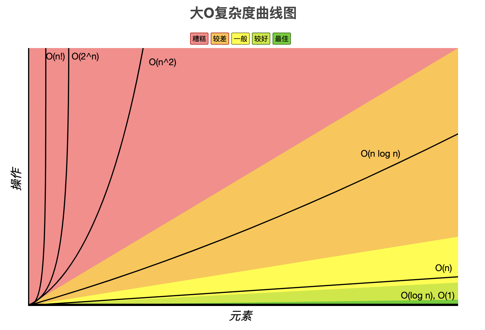

# 概述

**大道至简，始于算法。。。**



## 常数阶 O(1)
- O(1)  

算法的效率是固定的，无论你的数据量如何变化，效率都一样，这种复杂度也是最优的一种算法

```js
function algorithm() {
  console.time();
  let a = 1;
  let b = 1;
  let c = a + b
  console.log(c)
  console.timeEnd();
}
```
## 对数阶 O(log n)
- O(log n)  

`i` 并不是逐一递增，而是不断的翻倍：`1->2->4->8->16->32->64` 一直到等于 n 为止才会结束  
只要计算出 x 的值，就得到了循环次数，公式：`2^x = n`  
所以得出：`x = log2n`

```js
function algorithm() {
  console.time();
  let n = 256,
    i = 1;
  while (i < n) {
    i = i * 2;
    console.log(i);
  }
  console.timeEnd();
}
```
## 线性阶 O(n)
- O(n)  

for循环里面的代码会执行n遍，因此它消耗的时间是随着n的变化而变化的

```js
function algorithm() {
  console.time();
  let n = 256;
  for (let i = 0; i < n; i++) {
    console.log(i);
  }
  console.timeEnd();
}
```
## 线性对数阶 O(n log n)
- O(n log n)  

在对数阶外包裹一层循环即为`线性对数阶`  
在对数阶的基础上，它循环次数随着n的变化而变化

```js
function algorithm() {
  console.time();
  let n = 256;
  for (let j = 0; j < n; j++) {
    let i = 1;
    while (i < n) {
      i = i * 2;
      console.log(i);
    }
  }
  console.timeEnd();
}
```
## 平方阶 O(n^2)
- O(n^2)  

一个双层循环，随着n变化，循环次数为n*n，得知`O(n^2)`

```js
function algorithm() {
  console.time();

  let n = 256,
    j = 0;
  for (let x = 0; x < n; x++) {
    for (let i = 0; i < n; i++) {
      j++;
    }
  }
  console.log(j);
  console.timeEnd();
}
```
## 立方阶 O(n^3)

- O(n^3) 

一个三层循环，随着n变化，循环次数为n*n*n，得知`O(n^3)`

```js
function algorithm() {
  console.time();
  let n = 256,
    m = 0;
  for (let i = 0; i < n; i++) {
    for (let j = 0; j < n; j++) {
      for (let k = 0; k < n; k++) {
        m++;
      }
    }
  }
  console.log(m);
  console.timeEnd();
}
```
## 指数阶 O(2^n)
## O(n!)
## 空间复杂度