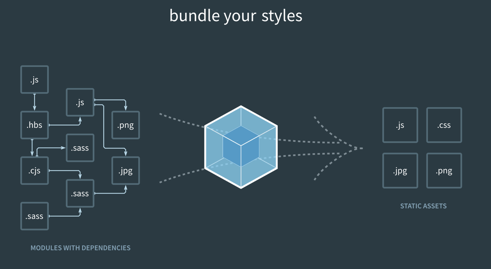
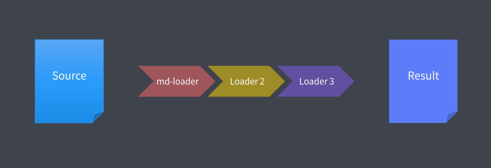

# Webpack

Webpack 会找到 entry 指定的入口文件作为打包入口  
Webpack 只能理解 JavaScript 和 JSON 文件  
- 根据入口文件代码中的 import 或 require 的语句解析，推断出来模块依赖，并解析每个模块的资源依赖，形成依赖树
- 递归依赖树，找到每个节点对应的资源文件，然后根据每个模块的 rules 匹配文件并执行对应的loaders，将进行资源加载转换，把最后的转换结果进行打包



## Loader
Loader: 用于资源加载并处理各种语言的转换/编译（例如：将不同语言转换为 JavaScript）
- 解析原始文件 -> 匹配rule,loader 编译,代码转换 -> loader 将处理完成后的结果, 交给 webpack进行打包 -> 输出最终文件 bundle.js



:::info 自定义loader
```js
// webpack.config.js 解析 .custom 自定义文件
{
  test: /\.custom$/,
  use: ["./loaders/custom-loader.js"],
},

// custom.custom file
(()=>{
    const p = window.document.createElement("p");
    p.innerHTML = 'source';
    window.document.getElementsByTagName("body")[0].append(p);
})()

// custom-loader.js
module.exports = (source) => {
  // 返回 loader 处理后结果，return buffer or string
  return source.replace("source", "loader处理后的结果");
};

// output
<body>
  <p>loader处理后的结果</p>
</body>
```
:::

## Plugin
Plugin: 用于资源加载以外的其他打包/压缩/文件处理等功能
- plugin通过 webpack 底层的特性来处理相应的钩子，在钩子回调中处理相关任务
- apply 方法有一个参数 compiler，通过 compiler 可以给 webpack 编译打包过程中添加钩子


:::info 自定义plugin
```js
// webpack.config.js  加载CustomPlugin插件
{
  plugins: [
    // 自定义plugin，压缩代码
    new CustomPlugin(),
  ]
}

// custom-plugin.js
var JSZip = require("jszip");
var path = require("path");
var fs = require("fs");

class CustomPlugin {
  zip = new JSZip();
  constructor(props = {}) {
    this.props = {
      dir: "./dist",
      zipName: "dist.zip",
      ...props,
    };
  }
  apply(compiler) {
    // 钩子函数执行回调
    compiler.hooks.afterEmit.tap("CustomPlugin", (compilation) => {
      if (fs.existsSync(path.resolve(this.props.dir))) {
        this.toZip();
      }
    });
  }
  readDir(obj, nowPath) {
    // 读取目录中的所有文件及文件夹（同步操作）
    let files = fs.readdirSync(nowPath);
    files.forEach((fileName, index) => {
      let fillPath = nowPath + "/" + fileName;
      // 获取一个文件的属性
      let file = fs.statSync(fillPath);
      // 如果是目录的话，继续查询
      if (file.isDirectory()) {
        // 压缩对象中生成该目录
        let dirList = this.zip.folder(fileName);
        // 重新检索目录文件
        this.readDir(dirList, fillPath);
      } else {
        // 压缩目录添加文件
        obj.file(fileName, fs.readFileSync(fillPath));
      }
    });
  }

  toZip() {
    this.readDir(this.zip, path.resolve(this.props.dir));
    // 压缩
    this.zip
      .generateAsync({
        // 压缩类型选择nodebuffer，在回调函数中会返回zip压缩包的Buffer的值，再利用fs保存至本地
        type: "nodebuffer",
        // 压缩算法
        compression: "DEFLATE",
        compressionOptions: {
          level: 9,
        },
      })
      .then((content) => {
        // 将buffer写入.zip
        fs.writeFile(this.props.zipName, content, (err) => {
          if (!err) {
            console.log(this.props.zipName + "压缩成功");
          } else {
            console.log(this.props.zipName + "压缩失败");
          }
        });
      });
  }
}
module.exports = CustomPlugin;

```
:::
## Directory
:::info directory
```js
├─ dist                 # 打包dist
├─ public               # 静态公共资源
│  ├─ index.html        # HTML
├─ loaders              # 自定义loader
│  ├─ custom-loader.js  # custom-loader.js
├─ plugins              # 自定义plugin
│  ├─ custom-plugin.js  # custom-plugin.js
├─ src                  # 源文件
│  ├─ custom.custom     # 未知文件，通过自定义loader进行解析
│  ├─ index.js          # index.js     入口
│  ├─ two-entry.js      # two-entry.js 入口
│  ├─ vue_main.js       # vue_main.js  入口
├─ webpack.config.js    # webpack config
```
:::
## Package.json
:::info package.json
```json
{
  "name": "surprise",
  "version": "1.0.0",
  "description": "webpack-config",
  "main": "/src/index.js",
  "scripts": {
    "dev": "webpack serve --mode=development --node-env development --progress",
    "build:prod": "webpack --mode=production --node-env production --progress",
    "build:dev": "webpack --mode=development --node-env development --progress"
  },
  "homepage": "https://github.com/hljinjiang/webpack-config#readme",
  "devDependencies": {
    "@babel/core": "^7.20.5",
    "@babel/preset-env": "^7.20.2",
    "babel-loader": "^9.1.0",
    "css-loader": "^6.7.3",
    "html-webpack-plugin": "^5.5.0",
    "jszip": "^3.10.1",
    "style-loader": "^3.3.1",
    "ts-loader": "^9.4.2",
    "typescript": "^4.9.4",
    "vue-loader": "^17.0.1",
    "webpack": "^5.75.0",
    "webpack-cli": "^5.0.1",
    "webpack-dev-server": "^4.11.1"
  },
  "dependencies": {
    "vue": "^3.2.45"
  }
}
```
:::
## Webpack.config.js
:::info webpack.config.js
```js
// 配置index.html页面的入口，自动在内存中根据指定页面生成一个内存页面
// 自动把打包好的 bundle 追加到html中
const htmlWebpackPlugin = require("html-webpack-plugin");
const { VueLoaderPlugin } = require("vue-loader/dist/index");
const CustomPlugin = require("./plugins/custom-plugin");

module.exports = {
  mode: process.env.NODE_ENV,
  // 入口，指示 webpack 应该使用哪个模块，来作为构建其内部 依赖图(dependency graph) 的开始
  entry: {
    vue_main: __dirname + "/src/vue_main.js",
    main: __dirname + "/src/index.js",
    two_entry: __dirname + "/src/two-entry.js",
  },
  // 输出，告诉 webpack 在哪里输出它所创建的 bundle，以及如何命名这些文件
  output: {
    // 打包输出路径
    path: __dirname + "/dist",
    // 文件名
    filename: "js/[contenthash].js",
    // 在生成文件之前清空 output 目录
    clean: true,
  },
  module: {
    rules: [
      // webpack 只能理解 JavaScript 和 JSON 文件
      // loader将处理import,require等其它的类型文件，比如对.css,Image,.ts转换成 Webpack能够识别的方式
      // 原始文件 -> 匹配rule,loader 编译,代码转换 -> loader 处理完成后的结果,交给 webpack进行打包 -> 输出最终文件 bundle.js
      {
        test: /\.css$/,
        // 从后向前处理，处理完成后交由 webpack打包合并到 bundle.js中
        use: ["style-loader", "css-loader"],
      },
      // 解析.ts
      {
        test: /\.ts$/,
        use: ["ts-loader"],
      },
      // 解析.js
      {
        test: /\.m?js$/,
        exclude: /node_modules/,
        use: {
          loader: "babel-loader",
          options: {
            cacheDirectory: true,
            // 缓存babel-loader 的执行结果
            // 之后的 webpack 构建，将会尝试读取缓存，来避免在每次执行时，可能产生的、高性能消耗的 Babel 重新编译过程(recompilation process)
            presets: ["@babel/preset-env"],
          },
        },
      },
      // 解析.vue
      {
        test: /\.vue$/,
        use: ["vue-loader"],
      },
      // 解析 .custom 自定义文件
      {
        test: /\.custom$/,
        use: ["./loaders/custom-loader.js"],
      },
    ],
  },
  // 扩展 webpack 功能，打包优化，资源管理，注入环境变量
  plugins: [
    // 生成一个 HTML5 文件， 在 body 中使用 script 标签引入你所有 webpack 生成的 bundle
    new htmlWebpackPlugin({
      template: __dirname + "/public/index.html",
      filename: "index.html",
    }),
    new VueLoaderPlugin(),
    // 自定义plugin，压缩代码
    new CustomPlugin(),
  ],
  // 配置模块如何解析
  resolve: {
    // 别名
    alias: {
      "@": "/src",
    },
    // 尝试按顺序解析这些后缀名，引入文件就可以不带后缀
    extensions: [".js", ".json", ".vue"],
  },
  // 开发工具
  devtool: process.env.NODE_ENV === "development" ? "source-map" : false,
  // 开发服务配置
  devServer: {
    host: "localhost", // 启动服务器域名
    port: "3000", // 启动服务器端口号
    open: true, // 是否自动打开浏览器
    hot: true, // 开启HMR功能
    http2: true,
    https: false,
  },
  // 从输出的 bundle 中排除依赖
  // 防止将某些 import 的包(package)打包到 bundle 中，而是在运行时(runtime)再去从外部获取这些扩展依赖
  // 例如，从 CDN 引入 Vue，而不是把它打包：
  externals:
    process.env.NODE_ENV === "development"
      ? {}
      : {
          vue: "Vue",
        },
  // optimization: {
  //   minimize: false,
  // },
};
```
:::

## 大致打包流程
1. 载入 webpack 核心模块，创建 compiler 对象
   1. 将 entry,output,module,plugins等参数和 shell 上的参数一并传入 compiler
2. 使用 compiler 对象开始编译整个项目
   1. 调用 compiler.run() 方法进行编译
3. 从入口文件开始，解析模块依赖，形成依赖关系树
   1. 根据 entry 配置找到入口文件
   2. 依次递归所有依赖，将依赖关系树的每个模块交给不同的loader(对源代码转换为webpack能够识别的文件)进行处理
4. 递归完成后，整理合并 Loader 处理完的结果，将打包结果输出到 output 目录


参考链接1⃣️：https://www.webpackjs.com/  
参考链接2⃣️：https://github.com/hljinjiang/webpack-config