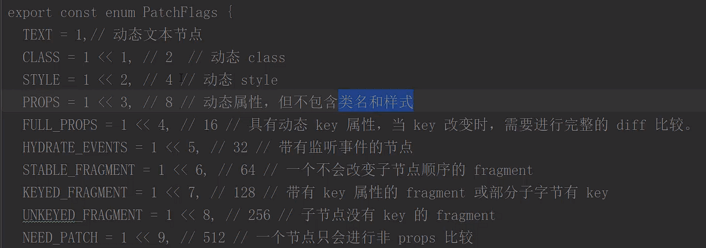

# Vue3

Vue3.0新特性
性能更好，速度更快

## diff算法差别
::: info 比较方式
- vue2 是全量比较，基于渲染的DOM树，当数据更新后生成新的虚拟DOM树，每个节点相比较，那个节点有变化，就替换那个节点
- vue3 是静态标记比较，基于渲染的DOM树，对会进行变化的数据绑定添加静态标记，当数据更新后生成新的虚拟DOM树，只会比较有静态标记的节点，如果有变化，则替换节点
静态标记会根据不同的变化，标记不同的数字，从而更高效的进行对比查找
:::

::: info 静态提升
- vue2 创建虚拟dom时，每个节点都会重新创建渲染一次
- vue3 就把不会变化的节点提出来，那么就不会再创建的时候再重新生成虚拟dom，而是复用之前提出来的虚拟dom，从而提升性能
:::

::: info 事件侦听缓存
- vue3 会对动态属性进行静态标记，会一直跟踪有静态标记的节点。但是对于事件来说，不会发生变化。因此，事件侦听缓存，去除了静态标记，就不会进行比较，那么就提升了性能
:::

## Vue2/Vue3
::: info 写法
- vue2
  - 数据：data
  - 业务逻辑：methods，watch，computed
  - 逻辑关注点分散，数据流不清晰，代码不易阅读和理解
- vue3
  - 解决代码不好复用，逻辑不好抽离
  - 逻辑关注点聚集，数据流清晰，代码容易阅读和理解
:::
