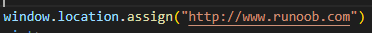
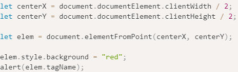

**JavaScript 存储对象**

**localstorage：本地存储（长久存储，需要手动删除数据）**

**sessionstorage：会话存储（临时存储，关闭窗口自动删除数据）**

**存储对象方法**

setItem("key","value")：保存数据需要key和value

getItem("key")：获取数据需要key

removeItem("key")：删除数据需要key

clear()：删除所有数据

**storage**事件

触发事件的属性

key：发生更改的数据的key

oldValue：旧值（如果时新增数据，则为null）

newValue：新值（如果时删除数据，则为null）

url：发生数据更新的文档的url

storageArea：发生数据更新的localStorage或sessionStorage对象

**浏览器数据库**

**indexedDB[indexedDB.note](note://B3D9316D40C0484DAB80072E96B14243)**

**History**

**包含浏览器中的URL**

**History对象属性**

length：历史列表中的网址数

**History对象属性**

back()：加载history中的前一个URL

forward()：加载history中的后一个URL

go(-1或1)：加载history列表中的某个具体页面

**Location 存储对象**

**包含当前URL的信息**

**存储对象属性**

**存储对象方法**

assign(URL)：载入一个新文档

reload(boolean)：重新载入当前文档（设置为true，会绕过缓存，从服务器重新下载该文档）

replace(newURL)：用新文档替换当前文档，**最好是使用replace，不要使用assgin**

**Navigator**

**包含有关浏览器的信息**

**Navigator对象属性**

appCodeName：浏览器代码名

appName：浏览器名称

appVersion：浏览器平台和版本信息

cookieEnabled：浏览器中是否启用cookie（返回boolean）

platform：运行浏览器的操作平台

**userAgent**：返回由客户机发送服务器的user-agent头部的值

plugins：返回浏览器的插件数组

**onLine**：检测该设备能否上网

window.addEventListener('online', navigator.onLine) // 设备**联网**时

window.addEventListener('offline', navigator.onLine) // 设备**断网**时

**connection**：浏览器与系统的联网的属性

downlink：10 // 当前设备宽带（Mbit/s）

effectiveType：4g // 当前设备连接速度与质量（2g、3g、4g）

rtt：250ms // 当前网络实际往返时间（延迟）

saveData：false // 表示当前用户是否启用”节流“

onchange：null // 当设备连接状态发生变化时激活change事件

navigator.connection.addEventListener('change')

navigator.connection.onchange = function  // 监听该连接事件

**hardwareConcurrency**：8 // 返回浏览器环境所拥有的的CPU核心数

**deviceMemory**：8 // 返回设备大致内存大小（0.5 == 500mb，1 === 1gb）

**maxTouchPoints**：0 // 返回设备触摸屏支持的最大关联触点数量，返回一个number

**Navigator对象方法**

javaEnabled()：浏览器中是否启用java

taintEnabled()：规定浏览器是否启用数据污点（data tainting）

**getBattery**()：访问设备电池与充电状态的信息

使用.then(result) -> 接收navigator.getBattery()的期约

result属性有：

charging：true // 该设备是否正接入电源充电

chargingTime：0 // 该设备的电池离充满还有多少秒

dischargingTime：0 || infinity // infinity表示该设备没有电池

level：1 || float number // 表示电量百分比

result方法有：

onchargingchange：监听电源充电变化

onchargingTimechange：监听电池充满时间的变化

ondischargingTimechange：监听电池耗尽时间的变化

onlevelchange：监听电池电量的变化

**Screen**

**包含有关客户端显示屏幕的信息**

**Screen对象属性**

availHeight：返回屏幕的高度（不包括windows的任务栏）

availWidth：返回屏幕的宽度（不包括windows的任务栏）

height：返回屏幕总高度

width：返回屏幕总宽度

colorDepth：返回设备或缓冲器上的调色板的比特深度（位数越高，颜色越多）

pixelDepth：返回屏幕的颜色分辨率（每像素的位数）

**Window**

**window对象表示浏览器中打开的窗口**

**如果文档中包含（frame或iframe标签）会为HTML创建一个新的Window对象**

**Window对象属性**

closed：返回窗口是否已被关闭（通过open和close方法打开关闭，可以检测是否关闭）

document：对Document对象的只读引用[js（DOM 元素对象）.note](note://2BA9CF0A119D403A999633AF2A538FE4)

frames：返回窗口中所有命名的框架

（返回window对象集合数组，每个window对象中含有一个框架）

history：history对象（浏览器中访问过的URL）[History对象.note](note://5B8ECF3EF2544339BB51F7C8A071ECB6)

innerWidth：返回窗口的文档显示区的高度（文档height）

innerHeight：返回窗口的文档显示区的宽度（文档width）

outerHeight：设置或返回窗口的外部高度（文档height+外部工具栏/滚动条）

outerWidth：设置或返回窗口的外部宽度（文档width+外部工具栏/滚动条）

pageXOffset：返回文档在窗口左上角水平滚动像素（滚动条距离水平像素）

pageYOffset：返回文档在窗口左上角垂直滚动像素（滚动条距离垂直像素）

length：返回或设置窗口中的框架数量

localStorage：本地存储key/value对的数据（长期存在，需要手动删除）

sessionStorage：同上（短期存在，关闭窗口自动删除存储数据）

[存储对象.note](note://7F1C15EA751848D78F3CC1F8B4F5DDB5)

location：用于窗口或框架的location对象[Location对象.note](note://41F3269F1AC4450E92602442A5324102)

name：设置或返回窗口的名称

navigator：对navigator对象的引用[Navigator对象.note](note://C80B477FF7144491A0CC98E50820F26B)

opener：返回对创建此创久的窗口引用（打开窗口的父窗口）

parent：返回当前窗口的父窗口信息

screen：对screen对象的引用[Screen对象.note](note://3543240A842A4ADBBA7549C8076155BA)

screenLeft：返回窗口相对于屏幕的X坐标（screenX，距离左边的距离）

screenTop：返回窗口相对于屏幕的Y坐标（screenY，距离顶部的距离）

self：返回指向当前window对象的引用，可以保证多个窗口的位置

top：返回当前窗口的最顶层浏览器窗口

**Window对象方法**

alert()：带有一段消息，确认按钮的警告框

confirm()：带有一段消息，确认按钮和取消按钮的对话框（返回true，false）

prompt(msg，defaulttext)：显示可提示用户进行输入的对话框（返回输入的字符串）

setInterval(function，milliseconds，params)：在指定的毫秒数，周期循环调用函数或计算表达式

setTimeout(function，milliseconds，params)：在指定的毫秒数后调用函数或计算表达式

function：执行函数

milliseconds：等待的毫秒数

params：传给function的其他参数

clearInterval()：取消由setinterval设置的timeout

clearTimeout()：取消由settimeout设置的timeout

open(URL，name，specs，replace)：打开一个新窗口

第三个参数接收一个字符串

“height=400,width=400,top=10”等，这些参数定义新窗口的属性

close()：关闭浏览器窗口

moveBy()：把当前浏览器相对于窗口移动（移动多少）

moveTo()：把窗口的左上角移动到一个指定坐标（移动到）

focus()：把键盘焦点给予一个窗口

stop()：停止页面的载入

scrollBy()：按照指定像素值来滚动内容（移动多少）

scrollTo()：把内容滚动到指定坐标（移动到）

btoa()：创建一个base-64编码的字符串

atob()：解码一个base-64编码的字符串

print()：打印当前窗口页面

matchMedia(media).matches：返回一个新的MediaQueryList，表示指定媒体查询后的结果，返回true或false

addListener(function)：添加一个监听器，当媒体查询的结果发生改变时触发

removeListener(function)：删除添加的监听器

**getComputedStyle**(element，伪类元素（可传null）)：用于获取指定元素的css样式

和element.style的作用相同，返回CSSstyledeclaration对象

**elementFromPoint**(X,Y)：返回在窗口坐标处嵌套最多的元素（element元素可以改变）

