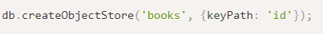
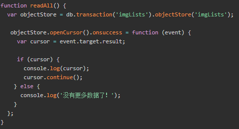
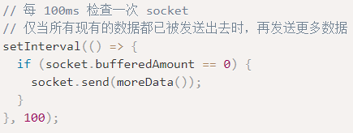

**IndexedDB**

浏览器内置的数据库，适用于离线应用

**let DB = indexedDB.open(name,version)（没有指定数据库，则会创建一个对应数据库）**

name：字符串，数据库名

version：正整数，版本号，默认为1

**打开事件**

DB.**onerror**：数据库准备就绪

DB.**onsuccess**：打开数据库失败

DB.**onupgradeneeded**

数据库已准备就绪（当打开时，没有数据库则触发）

当打开的指定版本号，大于数据库实际版本号，则会触发

**let deleteDB = indexedDB.deleteDatabase(name)**

删除数据库

删除事件

onerror、onsuccess

**DB.createObjectStore(name,[keyOptions])**

name：存储区的名称，创建对象库名称

keyOptions

keyPath：对象属性的路径，会将此路径作为键，例如id

autoIncrement：如果为true，则自动生成新存储的对象的键，是一个不断递增的数字

**事务**

事务是一组操作，要么全部成功，要么全部失败

所有数据操作都必须在indexedDB中的事务内进行

db.transaction(store, [type])

store：事务要访问的存储库名称，如“books”

type：readonly（默认，只读），readwrite（读写数据）

objectStore(name)：获取该存储库的存储对象

方法

**add**(value,[key])：执行对存储库的添加写入

**put**(value,[key])：执行对存储库的指定相同key值的更新

**get**(key)：获取指定key的数据

**getAll**()：获取所有数据

**delete**(key)：删除指定key的数据

**clear**()：清除所有数据

**openCursor**(query,[direction])：可以遍历存储库所有的记录

query：是一个键或键范围，与下面getAll相同

direction：

next（默认值，从最小索引向上移动）

prev（相反的顺序，从最大索引向下记录）

事件：

trans.onerror：捕获所有错误

trans.abort()：手动终止事务

trans.oncomplete()：保证事务完成之后触发

创建索引

**new worker（'.js'）**

**该对象执行对应URL的js**

**允许JavaScript创建多个子线程，子线程完全受主线程控制，不得操作DOM**

**用来处理一些比较耗时的事件**

**提升性能**

使用

new Worker("worker.js")

方法

postMessage(value)

向主线程或者子线程传输value

onmessage = function(e)

接收主线程或子线程传输过来的value

terminate()

主线程终止worker，不管之后还有没有消息传递

要想继续使用worker，必须重新创建worker

**AJAX**

**Asynchronous JavaScript and XML（异步的JavaScript和XML）**

**AJAX不是编程语言，而是使用现有标准的新方法**

**AJAX与服务器交换数据，在不重新加载网页的情况下更新部分网页**

**请求**

new XMLHttpRequest()：创建

new ActiveXObject("Microsoft.XMLHTTP")：IE老版本使用的语法

**setRequestHeader**(header,value)：向请求设置头

open(method,url，async)：规定请求类型，URL，是否异步

send(string)：将请求发送到服务器，string用于post

timeout：设置超时时间（xhr.timeout = 1000）

**响应**

**onreadystatechange**：存储函数，每当readyState属性改变，就会调用该函数

**readyState**：存有XMLHttpRequest的状态

0：请求初始化

1：服务器建立连接

2：请求已接收

3：请求处理中

4：请求已完成

**status**：请求状态（200：‘OK’，404：未找到页面）

**responseText**：获得字符串形式的响应数据

**responseXML**：获得XML形式的响应数据

**事件**

onload：请求完成，并且响应已完全下载

onerror：当无法发出请求

onprogress：下载响应期间定期触发，报告已经下载了多少

ontimeout：监听是否超时

xhr.abort()：终止请求

xhr.upload：比如在POST一些内容时，在上传时触发事件

**跨域**

xhr.withCredentials = true

CORS策略进行跨域请求

[HTTP.note](note://A22DC6B82F7B47E89FEA70BA55DC4725)

**Fetch**

JavaScript的api接口，用于访问和操作HTTP请求（现代通用方法）

fetch(url)

.then((response) => { return response.json()})

.then((myjson) => { console.log(myjson)})

需要json()方法，转换响应的数据

fetch(url,options)

options包含一些可选参数

body：JSON.stringify(data),  // 发送主体数据

headers:{     // 设置请求头

'user-agent': 'Mozilla/4.0 MDN Example',

'content-type': 'application/json'

// Formdata对象，设置为application/x-www-form-urlencoded

}

method: 'POST'，

mode: 'cors',   // 允许跨域（cors || same-origin || no-cors）

credentials: 'include || same-origin'

让浏览器发送包含凭据的请求（跨域源）使其跨域

只在同一源时发送凭证

**上传文件FormData**

new FormData()    // 可以遍历键值

append('username', 'abc123') // key，value

append(files, filed.files[0])

set(name, value1)

设置key，value（该方法会移除相同的name字段，而append不会）

set(name. blob, fileName)

delete(name)

get(name)

has(name)

在fetch中使用formdata，会自动设置请求头，不用手动设置content-type

**自定义请求对象**

new Request(url, options)

放在fetch()中，构成对应的url和options

**自定义请求头**

new Headers({

'Content-Type': 'text/plain'

`    `})

headers.has('Content-type')：判断是否有该请求头

headers.set('Content-type','text/html')：设置请求头

headers.append('Content-Type',‘value’)：追加请求value

headers.get('Content-Length')：获取该请求头的长度

headers.getAll('Content-type')：获取该请求头的value

headers.delete('Content-type')：删除该请求头的value

**自定义请求头可以作为参数，设置成fetch请求头**

response

fetch的请求状态异常不会报错error（会是404和500）

response.body

response.text()：读取response，并以文本形式返回response

response.json()：读取response，解析为JSON

response.formData()：以Formdata对象的形式返回response

response.blob()：以Blob（具有类型的二进制数据）形式返回response

response.arrayBuffer()：以arrayBuffer（低级别的二进制数据）形式返回response

response.header

response.headers.get('Content-Type')

**WebSocket**

是一种在浏览器和服务器之间建立持久持续连接的现代方式

websocket没有跨域限制，可以发送/接收字符串和二进制数据

let socket = **new WebSocket**("**ws**://localhost:8080")

打开一个websocket连接

**wss**://

可以使用该协议，该协议是被加密的，而且更可靠

**属性事件**

socket.**onopen**：连接已建立

可以在此处发送消息

socket.**send**(data)

socket.**onmessage**：接收服务端发送的数据

socket.**onerror**：websocket发生错误

socket.**onclose**：连接已关闭

连接关闭可能是客户端主动关闭，也可能是服务端主动关闭

socket.**close**(code, description)

数字状态码，解析连接关闭原因

对连接关闭的描述

**属性**

socket.bufferedAmount

返回已经被socket.send()放入队列中，但还没有被发送到网络的数据字节数

如果不断调用send(),则该属性值会持续增长

socket.url

返回值为构造函数**创建websocket实例对象时的URL**

socket.readyState

返回当前websocket的链接状态

**心跳重连**

websocket 一般 每隔90秒无操作则会自动断开，需要加入一个心跳机制防止自断

就是设置定时器setInterval，持续socket.send()向服务端发送消息

1

**EventSource**

**websocket有以下几点不同：**

SSE是使用http协议，而websocket是一种单独的协议

SSE是单向传输，只能服务端向客户端推送，websocket是双向

SSE支持断点续传，websocket需要自己实现

SSE支持发送自定义类型消息
