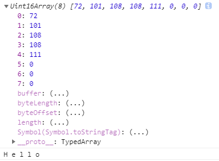
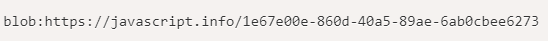
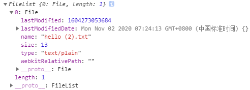
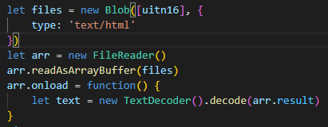
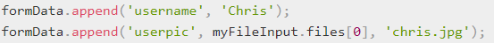
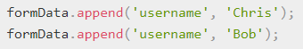
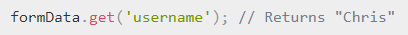
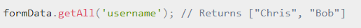
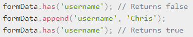

**二进制格式**

在传输文件时（创建，上传，下载，最多的是图像处理）

let buffer = **new ArrayBuffer(length)**

基本的二进制对象-----表示**通用的、固定长度的原始二进制数据缓冲区，是一个字节数组**

arraybuffer是所有**定型数组及视图引用**的基本单位

属性

buffer.byteLength：byte的大小，构造时生成，不可改变

**ArrayBuffer对象并没有提供读写内存的方法，而是允许在其上方建立视图，从而插入与读取内存中的数据**

**如需操作ArrayBuffer，需要使用数组缓冲区视图（以下为视图类型）**

**定型数组视图，基本拥有数组的原生方法**

**定型数组：**

**Uint8Array**：将ArrayBuffer中每个字节视为0到255之间的单个整数，8位无符号整数（1,1）

1个字节一个元素

**Uitn16Array**：将每2个字节视为一个0到65535之间的整数，16位无符号整数（2,1）

2个字节一个元素

**Uitn32Array**：将每4个字节视为一个0到4294967295之间的整数，32位无符号整数（4,1）

4个字节一个元素

**Float64Array**：将每8个字节视为5.0x10-324 到 1.8x10308 之间的浮点数（8,1）

8个字节一个元素

属性

name：返回Utin8Array类型的构造名“Utin8Array”

BYTES\_PER\_ELEMENT：返回数组中元素的字节数(一个数字代表几个字节)

new TextDecoder()文本解码器，可以解析数据视图中的**数字**为**对应字符**

**Dataview视图**

**用于向底层ArrayBuffer写入值**

**new DataView**(buffer,byteOffset,byteLength)

**参数**

buffer：存在的**ArrayBuffer**对象

byteOffset：第一个字节在buffer中的字节偏移（默认第一个字节开始）

byteLength：指定DataView对象的字节长度（默认匹配buffer的长度）

**方法**

设置ArrayBuffer中对应的-bit数（8，16，32，64无符号字节）

**TypedArray**

所有Uint8Array、Uint16Array都称为TypedArray

**TypedArray**拥有**数组的所有方法**，除了**splice**和**concat**

**TextDecoder、TextEnCoder**

可以解码所有二进制arrayBuffer、有无符号整数（Uint8Array、Int8Array）

**Blob除外[Blob.note](note://FC8962FCACC64C0B83C58D232291E732)**

**new TextDecoder（label，options）**：文本**解码器**（将**字节**转换为**字符串**）

**label**：默认utf-8格式

**options：**

fatal：默认为false，使用\uFFFD替换无效字符，为true则无效字符抛出异常（不可解码）

**方法**

**decode**(**BufferSource**,stream)

**buffersource**：arraybuffer对象本身，或者是arraybuffer的视图类型（如Uint8Array、Uint16Array等）

stream：对于解码流，为true，则将传入的buffer作为参数重复decode，表示“未完成”的字符，并在下一个数据块来的时候进行解码

**new TextEncoder（）**：文本**编码器**（将**字符串**转换为**字节**）

只支持utf-8编码

**encode**(str)

字符串编码成Uint8Array

encodeInto(str, destination)

将str编码到destination中，该目标必须为Uint8Array

**Blob**

表示一个不可变、**原始数据的类文件对象**，数据可以按文本二进制的格式进行读取，用于数据操作

Blob最大的用途就是**解析转换为URL地址**，当然他也可以**转换为file之类的文件**或**ArrayBuffer**

**new Blob**(blobParts,options)

blobParts：Blob/BufferSource/String类型的数组（必须由数组包裹）

options

type：Blob类型（如image/png，text/html）

endings：是否转换换行符，使Blob对应当前操作系统的换行符（\r\n或\n）

默认啥也不做，false

方法

blob.**slice**()（blob使无法更改的，但是可以通过slice获得多个部分的Blob）

byteStart：起始字节，默认为0

byteEnd：最后一个字节（默认为最后）

contentType：新blob的type，默认与源Blob的type相同

**Blob用作URL**

可以将blob转换为字符串，地址用作于url地址

使用URL.createObjectURL(blob)将Blob转换为字符串

**Blob用作base64**

使用内建的FileReader方法，该方法继承与Blob

以上都可转换为url

createObjectURL需要撤销revoke它们，释放内存，直接访问Blob无需编码解码

readAsDataURL无需撤销，但对大的Blob编码时会消耗性能和内存

**Blob转ArrayBuffer**

使用FileReader构造函数转换

**File和FileReader**

**File**对象继承自Blob，并扩展了与文件系统相关的功能

**new File**(fileRarts,fileName,[options])

fileParts：Blob/BufferSource/String类型值的数组

fileName：文件名字符串

options：

lastModified：最后一次修改的时间戳

<input type="file" onchange="showFile(this)"/>

当文件上传时，会触发方法，this里面会有file的信息

**new FileReader()**// 没有参数

**readAsArrayBuffer**(blob)：将数据读取为二进制格式的ArrayBuffer。

**readAsText**(blob, [encoding])：将数据读取为给定编码（默认utf-8编码）的文本字符串

**readAsDataURL**(blob)：读取二进制数据，并将其编码为base64的data url

**abort**()：取消操作

以上读取过程，有以下事件

1

**FormData**

提供表示表单数据的键值对key/value的构造方式，也可以通过XMLHttpRequest.send()发送

Formdata对象，可以设置**header**为**application/x-www-form-urlencoded**

在发送服务端时，会**自动设置编码类型**“**multipart/form-data**”，它会**使用和表单一样的格式**

**new FormData(form)**

form：指定form表单元素

将**自动把form中的表单值也包含进去**，**文件内容也会被编码**

**方法**

**append(name,value,filename)**

name：key

value：String || Blob || File

filename：传给服务器的文件名称

**delete(name)**

要删除的键（key）的名字

**entries()**

返回iterator（可迭代），可以遍历formdata

**get(name)**

获取值的键名（如果有重复的，就返回第一个）

**getAll(name)**

获取所有的值的键名

**has(name)**

检测查询的name

**keys()**

返回一个name的迭代器

// key1，key2

**set(name,value,filename)**

他和append作用一样

不同之处

set会覆盖存在的相同key所对应的值，不会重复添加

**values()**

返回一个value的迭代器

// valu1，value2

**URL**

返回一个新创建的URL对象，表示由一组参数定义的URL（还是URl）

如果给定的URL或生成的URL不是有效的URL链接，则会抛出一个TypeError

new URL(url, base)

url：表示一个绝对或者相对的URL，将base用作基准URL

base：表示一个基准URL的DOMString，默认为相对路径

USVString === DOMString 直接映射一个 String

new URL()属性

hash：返回URL中#的表示hash值

host：返回URL中的主机名

hostname：返回URL中的域名

href：返回URL完整的USVString值

origin：返回URL源经过Unicode序列化的值

pathname：返回URL路径名

port：返回URL的端口号

protocol：返回URL的协议

search：返回URL接口搜索字符串（如get查询字符串）

searchParams：返回URL的查询参数（查询的value，不包含key）

new URL()方法

URL.createObjectURL(object)

object用于创建URL的file文件、blob对象、mediaSource对象

**内存管理**

每次调用该方法会创建新的URL对象，即使你已经用相同对象作为创建过

可以使用URL.revokeObjectURL()方法来释放该对象

URL.toJSON

以字符串形式返回URL

URL.toString

以字符串形式返回URL

是一种数据格式，不是变成语言，JSON不属于JavaScript

语法表示的值

简单值

直接表示string，number，Boolean，null

数组

与JavaScript一样的数组，具有二维数组、三维等，对象组为数组元素

对象

对象使用{}包括，使用每组由键值对构成

JSON格式

对象的属性必须加上双引号

末尾没有分号

json能够直接解析为JavaScript对象

JSON.parse()

序列化JavaScript

JSON.stringify(object，filter，indent)

JavaScript对象

过滤需要转换的属性，只会过滤出包含的属性，可以是数组

是否保留缩进（true, false）

JSON.stringify({a:123,b:321}, (q,w) => {return w},1)

第一个参数，value：需要转换为json字符串的值

第二个参数，为函数时

接收两个参数，key和value，可以进行处理，返回的就是处理过后的值

第二个参数，为数组时

接收需要转换的key

返回接收的key和value的对象

第三个参数，json字符串的缩进
