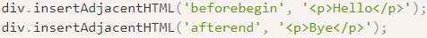
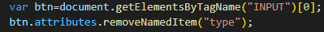

**DOM Document**

**HTML DOM（document object model）每个元素都是节点**

**当浏览器载入HTML文档时，它就会成为document对象**

**document对象是HTML文档的根节点**

**document对象可以从脚本中对HTML页面中的所有元素进行访问**

**document对象是window的一部分，可以通过window.document访问**

**一、Document对象**

**一、选中对象**

getElementById：返回带有指定id的第一个对象（id（单个））

getElementsByClassName：返回带有指定类名的元素集合（class（集合））

getElementsByName：返回带有指定名称的对象集合（name（集合））

getElementsByTagName：返回带有指定标签名的集合（标签名p,h1,div,\*（集合））

针对HTMLcollection，有一个方法，可以获取集合中name属性对应的第一个元素

如：images.**namedItem**['myname']

querySelector：返回文档中匹配的css选择器的第一元素（#id，.class，p[class='xxx']）

querySelectorAll：

（1）返回匹配文档中匹配的css选择器所有元素（#id，.class，p[class='xxx']，div > p）

body：文档的body元素，包括子元素

.matches(".page")：接收css选择符参数，检测该元素会不会被queryselect和queryselectall方法返回。

**二、创建对象**

createAttribute：创建一个属性节点（var att = createAttribute(“class”)）

（1）ele.setAttributeNode(att)：对元素添加新的属性节点

（2）ele.setAttribute('属性'，‘属性值’)：对元素创建添加属性

createComment：创建注释节点（插入到某个元素appendChild）

createDocumentFragment：创建空的documentfragment对象，并返回此对象，

创建了虚拟节点对象，可以增加删除某些内容插入，更安全的改变文档构

createElement("BUTTON")：创建元素节点

createTextNode("CLICK ME")：创建文本节点

ele.remove()：移出该节点

**DocumentFragment：相当于DOM的包装器**

使用new DocumentFragment对该实例化对象进行**append等dom操作**

返回的是一个DOM集合，**在页面会显示出这个集合**

1

**三、内容（属性）**

activeElement：获取当前焦点元素

anchors：获取当前页面所有锚的集合（a标签，拥有name属性的）

baseURI：返回文档的绝对基础URI（统一资源标识符）

cookie：设置或返回当前文档有关的cookie（设置 cookie='name=小林'）

doctype：返回文档声明内容（html）

documentElement：以一个元素对象返回一个文档的文档元素（HTML）

documentURi：设置或返回文档的位置（http://www.http.com/jst）

domain：返回文档的域名（www.http.com）

embeds：返回文档中embeds元素的集合（embed标签的数量，引入插入外部url）

forms：返回文档中所有forms表单的集合（form标签的数量）

images：返回文档中所有img的集合（img标签的数量）

implementation：返回处理该文档的DOMimplementation对象

lastModified：返回文档最后被修改的日期和时间

inputEncoding：返回文档的编码（UTF-8）

links：计算文档所有链接的数组（a标签href，area标签）

readyState：返回当前文档的状态（载入中...）

（1）uninitialized：还未开始载入

（2）loading：载入中

（3）interactive：已加载

（4）complete：载入完成

referrrer：返回载入文档的文档的URL（href跳转页面的地址）

scripts：返回文档中所有script元素的集合（script集合）

title：文档的标题（title）

URL：文档完整的URL地址

write：向文档输出HTML表达式或JavaScript代码

writeln：同上，不同的是在每个表达式之后会写一个换行符

**compat**：检测当前文档的渲染模式是怪异模式/混杂模式/标准模式（默认标准模式）

CSS1Compat：文档不是怪异模式（标准模式/准标准模式）

BackCompat：文档是怪异模式

characterSet：返回文档的字符集属性，并可以修改

UTF-8/UTF-16

document.characterSet = ''UTF-8

**四、方法**

addEventListener：添加事件句柄

事件名，处理事件的函数，

布尔值（true表示在事件捕获阶段调用事件，false表示在事件冒泡阶段）

removeEventListener：移除事件句柄

adoptNode：可以从另外的文档中获取子节点到当前文档

（1）节点下所有子节点都会获取到，会删除拿取文档中的节点

importNode(node,Boolean)：把一个节点从另一个文档复制到该文档以便应用

（1）boolean为true的话会复制该节点的所有子孙节点

open('text/html','replace')：打开一个流，接收document.write()，输出流展示内容

close()：关闭一个打开的流，并显示数据

normalize：合并相邻文本节点并删除空的文本节点（规范文档）

**五、富文本交互**

document.designMode = 'on' // 控制整个文档是否可以编辑（on可编辑 || off不可编辑）

**DOM**

**HTML Collection 时HTML元素的集合，类似于数组列表**

**getElementsByTagName()方法返回指定标签名的HTML Collection**

**DOM（HTML Collection）事件**

item：返回指定索引的元素

getElementsByTagName("p")[0]

length：返回元素的数量

getElementsByTagName("p").length

namedItem：返回指定的ID或name属性的元素

getElementsByTagName("p").namedItem('id')

**2020-10-25**

有些元素集合可以直接通过tag查找，如：table

有些元素集合可以直接通过document.查找，如form、images

**DOM**

**元素对象代表HTML元素**

**元素对象的子节点，可以是元素节点，文本节点，注释节点**

**NodeList对象代表了节点列表，类似于元素的子节点集合**

**元素（element）对象**

**一、属性节点**

accessKey：设置或返回accessKey一个元素

（元素设置accessKey = “g”，alt+g可访问链接等）

attributes：返回元素属性的数组（属性的集合）

childNodes：返回元素的一个子节点的数组（子元素节点集合）

children：返回元素的子元素集合（子元素集合）

**classList**：返回元素类名（class，可以对class进行操作）

（1）add：添加class属性类名

（2）contains：返回布尔值，判断指定类名是否存在

（3）remove：移除class属性类名

（4）toggle(class,true|false)：在元素中切换添加类名（移除和添加）

（1）只设置第一个参数，当存在指定class时，会移除class

（2）当不存在指定class时，会添加class属性

（3）第二个参数设置false时，强制移除指定class

（4）第二个参数设置true时，强制添加指定class

（5）item（number）：返回当前索引的class类名

className：设置或返回元素的class属性名

tagName：返回元素的标签名

id：设置或返回元素的id（id = 'asd'）

**firstChild**：返回元素的第一个子元素

**lastChild**：返回元素的最后一个子元素

nextSibling：返回元素之后紧跟的元素（包括文本节点，注释节点）

**nextElementSibling**：**返回元素之后紧跟的兄弟元素（不包括以上）**

previousSibling：返回元素之前紧接的节点（包括文本节点，注释节点）

**previousElementSibling**：**返回元素之前紧接的节点（不包括以上）**

**contentEditable**：设置元素的内容是否可编辑（true：可编辑，false：不可编辑）

dir：设置或返回元素的文字方向（rtl：从右到左排列，ltr：从左到右排列）

innerHTML：设置或返回元素内容（可以解析标签）

innerText：设置或返回元素内容（不可以解析标签）

textContent：设置或返回一个节点和它的文本内容

lang：设置或返回一个元素的语言

nodeName：可依据节点的类型返回其名称（标签名，属性名）

nodeType：返回节点类型

（1）1：元素节点

（2）2：属性节点

（3）3：文本节点

（4）8：注释节点

nodeValue：返回元素的节点值

☐ parentNode：返回某节点的父节点

ownerDocument：返回某元素的根元素（文档document）

**tabIndex**：设置或返回 tab 按键的控制次序

title：设置或返回元素的title属性

**parentElement：父元素**

**firstElementChild：某元素下的第一个子元素**

**lastElementChild：某元素下的最后一个子元素**

**二、方法**

addEventListener：向指定元素添加事件句柄

removeEventListener：向指定元素移除事件句柄

**appendChild**：向指定元素末尾添加子元素

**append**：也是在元素末尾添加子元素

两者区别

**appendChild**只能传入**一个节点**，**不支持字符串**，插入的节点需要**createElement**等操作创建或具有的dom节点

**append**可以传入**多个节点**和**字符串**

**prepend**：向指定元素开始位置插入子元素

insertBefore：向指定元素的子节点前插入新子节点

（需要插入的节点元素，节点前的子节点）

插入的是节点对象

removeChild(节点对象)：删除一个子元素

replaceChild(newnode，oldnode)：替换一个子元素

cloneNode：拷贝指定元素的属性和值，设置参数true会复制指定元素的所有节点

p1.compareDocumentPosition(p2)：比较两个节点的文档位置

（1）1：不属于同一个文档（没有关系）

（2）2：p1位于p2之后

（3）4：p1位于p2之前

（4）8：p1位于p2之内

（5）16：p2位于p1之内

（6）32：两个节点在同一元素的两个属性（没有关系）

focus：为元素设置焦点（如果可以设置）

getAttribute：返回指定元素属性的属性值

getAttributeNode：返回指定属性，通过属性名称获取属性节点（包括属性，属性值）

setAttribute：设置指定属性和属性值（属性名，属性值）

setAttributeNode（属性节点）：设置属性节点

（通过 createAttribute 创建的属性节点，nodeValue 定义属性值）

hasAttribute：判断元素是否有指定属性

hasAttributes：判断元素是否有任何属性

hasChildNodes：判断元素是否具有子元素

hasFocus：判断检测元素或文档是否获得焦点

isContentEditable：判断元素是否可编辑

namespaceURI：返回被选节点峨命名空间URI

isDefaultNamespace：判断指定的namespaceURI（命名空间是否默认）

p1.isEqualNode(p2)：判断两个节点是否相等

p1.isSameNode(p2)：当节点与给定的节点是同一个节点时返回true，否则返回false

item.isSupported("Core","2.0")：判断当前节点是否支持某个特性

normalize：合并相邻的文本节点并删除空的文本节点

style：设置或返回元素的样式属性

**nodelsit**.item：返回子节点列表的指定索引（childNodes.item(0)）

**nodelist**.length：返回节点列表的节点数目（childNodes.length）

**三、屏幕及滚动条属性**

clientHeight：返回页面 or element内容的viewport可视高度（不包括边框，边距及滚动条）

clientWidth：返回页面 or element内容的viewport可视宽度（不包括边框，边距及滚动条）

scrollHeight：整个元素的高度（包括滚动条以及隐蔽的地方）

scrollWidth：整个元素的宽度（包括滚动条以及隐蔽的地方）

scrollLeft：返回当前视图中的实际元素的左边缘和左边缘之间的距离

scrollTop：返回当前视图中的实际元素的顶部边缘和顶部边缘之间的距离

offsetHeight：返回元素的高度（包括边框和填充，但不是边距）

offsetWidth：返回元素的宽度（包括边框和填充，但不是边距）

offsetTop：返回当前元素的相对垂直偏移位置的偏移容器（**offset表示偏移尺寸**）

offsetLeft：返回当前元素的相对水平偏移位置的偏移容器

offsetParent：返回元素的偏移容器，返回最外层父元素

getBoundingClientRect()：{} 每个元素都有这个方法，返回一个domrect对象

返回属性：

left/x：该元素左边距离页面左边的距离（对应鼠标clientX）

top/y：该元素上边距离页面上边的距离（对应鼠标clientY）

bottom、right：该元素右边距离页面左边的距离，该元素底边距离页面上边的距离

**DOM**

**Attr对象代表一个HTML元素的属性**

**属性属于HTML元素**

**元素（attributes）对象（返回对象）**

**一、属性/方法**

isId：检测元素的属性是否是ID类型

name：返回属性的名称（属性名onclick等）

value：返回或设置属性值

specified：如果属性被指定则返回true，否则返回false（）

比如  getAttributeNode("onclick") 指定了onclick，则返回true

getNamedItem：返回节点列表中指定属性名的值

比如 attributes.getNamedItem("onclick").textContent 返回属性值

item(0)：返回属性节点列表中指定索引的节点

比如 attributes.item(0).nodeName 返回属性及属性值

length：返回attributes的数目长度

removeNamedItem('type')：删除指定属性节点

setNamedItem(attribute)：添加指定节点

**DOM**

**Console对象提供浏览器调试模式的信息到控制台**

**DOM（console）事件**

**一、方法**

assert：如果断言为false，则在控制台输出错误信息

（表达式：true or false，message）

clear：清除控制台上的信息

count：记录count调用次数

warn：输出警告信息到控制台

error：输出错误信息到控制台

group：在控制台创建一个信息分组（对console输出进行分组）

groupCollapsed：创建一个折叠的信息分组

groupEnd：结束当前分组

info：控制台输出一条信息

log：控制台输出一条信息

table(['xxx'])：以表格形式显示数据

time和timeEnd：测试程序执行的时长

trace：显示当前执行代码的堆栈调用路径

**CSS样式声明对象（CSSStyleDeclaration）**

**CSS属性-值对的集合**

**一、属性**

ele.style.cssText：样式声明文本，HTML元素的style属性（style.cssText）

ele.style.length：样式中包含多少条声明

ele.style.parentRule：包含当前规则的规则（返回CSSRule对象，包含css声明样式及选择器）

**二、方法**

ele.style.getPropertyPriority：返回指定CSS属性是否设置了important!优先级。

**styleSheets[0].cssRules[0]**.style：获取style样式表的第一个选择器的样式

cssRules：当前样式表包含的样式规则的集合

ele.style.**getPropertyValue**：返回指定CSS属性的值

ele.style.item：通过索引返回CSS声明中的CSS属性名

ele.style.removeProperty（’color‘）：移除CSS声明中指定的CSS属性名

ele.style.setProperty（’color’，‘yellow’）：设置新的CSS属性，同时可以修改已声明的属性

**三、styleSheets（head中的style）**

document.styleSheets返回style集合

属性：

**disabled：false**// 设置样式表的disabled会禁用该样式表（失效）

**href：null**// 如果是使用的<link>包含引入的样式表，则返回该样式表URL

media：[]  // 样式表支持的媒体类型集合（@media媒体类型）

**parentStyleSheets**：{}  // 指向他的父样式表规则

**type**：“text/css” // 样式表类型

**cssRules**：[] // 当前样式表包含的样式规则（返回数组，每个选择器对象一个规则）

**cssText**：""    // 返回整条样式规则的文本字符串

**parentStyleSheets**：[] // 返回整条样式规则样式表

**selectorText**：“.top”  // 返回该条规则的选择符

**style**：{}    // 返回CSSStyleDeclaration对象（相当于ele.style）

**type**：1    // 返回规则类型

**ownerRule**：{} // 如果样式表是使用@import导入，则指向导入规则，否则为null

方法函数

deleteRule：(index)  // 在指定位置删除styleSheets中的cssRules中的规则

insertRule：(cssRule，index) // 在指定位置向cssRules中插入规则

**DOMContentLoaded，load，beforeunload，unload**

DOMContentLoaded

DOM就绪，可以查找DOM节点，并初始化接口

**async脚本会在domcontentloaded之前或之后运行**

因为domcontentloaded只关注html是否解析完毕，而不关注async脚本加载执行

**async在html解析完之前下载完成，会直接执行**

**async在html解析完之后下载完成，会直接执行**

**defer脚本会在domcontentloaded之前运行**

会在html解析完毕后执行，执行完成触发domcontentloaded

**defer在html解析完之前下载完成，会等待html解析完后执行**

**defer在html解析完之后下载完成，会直接执行**

load

外部资源已完成，样式已被应用，图片大小也已知

beforeunload

用户正在离开，可以检测用户是否保存了更改，并询问他是否确定是否要离开

unload

用户几乎离开，但仍然可以启动一些操作，例如发送统计数据

readyState（文档状态）

loading-----文档正在被加载

interactive-----文档全部被读取

complete-----文档全部被读取，所有资源（图片）都已加载完成

**DOM 变动观察器（mutation observer）**

观察DOM元素，在其发生更改时触发回调

**let observer = new MutationObserver(callback)**

observer.observe(node, config)

config对象配置（该**Boolean**表示“**将对哪些更改做出反应**”）

childList：Boolean（node的直接子节点的更改做出反应）

subtree：Boolean（node的所有后代的更改做出反应）

attributes：Boolean（node的特性的更改做出反应）

attributeFilter：Boolean（特性名称数组，只观察选定的特性）

characterData：Boolean（是否观察node.data（文本内容的更改））

characterDataOldValue：Boolean（将旧的数据传递给回调：oldValue）

observer.disconnect()

停止观察

observer.takeRecords()

获取尚未处理的变动记录列表，记录已经发生，但是observe回调暂未处理的变动

**Range**

可以选择dom的范围，进行删除，修改，克隆

**每个子节点都是一个范围**

方法

var Range = document.createRange()

相同操作：let range = new Range()

查看dom的相关属性（range.collapsed）

**collapsed**（只读）

Range的范围起始位置是否相同

**commonAncestorContainer**（只读）

包含完整的startcontainer和endcontainer的、最深的的一级节点（body）

**startContainer**（只读）

包含range开始的节点（element元素节点，包含子元素在内）

**startOffset**（只读）

表示range起点在startcontainer中的数字

**endContainer**（只读）

包含range结束的节点（element元素节点，包含子元素在内）

**endOffset**（只读）

表示range终点在endcontainer中的数字

查询dom方法

**setStart**(startnode，startoffset)

开始节点，设置range的起点（Number：下标从0开始）

**setEnd**(endnode，endoffset)

结束节点，设置range的终点（Number：选择number之前的节点）

**setStartAfter**(startnode)

以其他节点为基准，设置起点在node后面（起点为body）

**setStartBefore**(startnode)（offset会相对After - 1）

以其他节点为基准，设置起点在node前面（起点为body）

**setEndAfter**(endnode)

以其他节点为基准，设置终点node后面（终点为body）

**setEndBefore**(endnode)（offset会相对After - 1）

以其他节点为基准，设置终点node前面（终点为body）

**selectNode**(node)

使其包含node节点的外层element，选择整个node

**selectNodeContents**(node)

使其起点和终点都为node，选择整个node的内容

编辑dom方法

**cloneContents**()

克隆range的所有node节点，相当于DocumentFragmen（节点包装器）

可以**append**给其他节点

**deleteContents**()

移除range包含的内容，将会删除element节点

**extractContents**()

移动range包含的内容，可以appendChild给其他节点，range包含的节点将移动到当前节点

**surroundContents**(newNode)

将range内容移动到新的节点中，并将此节点放入range范围的起始处

**select（Range）**

(window or document).**getSelection()**

表示用户选择的文本范围或光标的当前位置

**attributes**

**anchorNode**：选择的起始节点

**anchorOffset**：选择开始的anchorNode中的偏移量

**focusNode**：选择的结束节点

**focusOffset**：选择开始处的focusNode的偏移量

**isCollapsed**：未选择任何内容（空范围），则为true

**rangeCount**：选择中的范围数，除firefox之外，最多为1

选择事件（selection事件）

elem.**onselectstart**：在该元素选择开始选择移动鼠标时

阻止默认行为会使选择无法开始

document.**onselectionchange**：选择某个元素移动鼠标，选择变动时

选择方法

getRangeAt(i)

获取从0开始的第i个范围（选择range范围，可以克隆该节点）

addRange(range)

将range添加到选择中（会选中页面对应的元素范围）

removeRange(range)

将从选择中删除range

removeAllRangeS()

删除所有范围

empty()

removeAllRanges的别名

