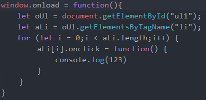
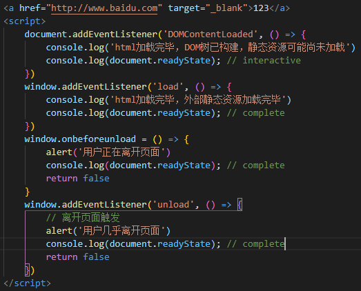

# JavaScript Engine
::: v-pre
`一个页面中的所有 JavaScript 脚本，以及呈现布局，回流，和垃圾回收都在一个线程中运行。`  
`本节总结由 JavaScript 引擎所环绕的相关浏览器知识点`
:::

**进程和线程**
::: info
`进程：CPU 进行资源分配的基本单位`  
`线程：CPU 调度的最小单位，建立在进程的基础上运行的单位，共享进程的内存空间`  
`多进程：多个进程建立运用运行，进程之间互不影响`  
`多线程：多个线程建立工作，可互相通信，共同完成任务`
:::
## 页面常用线程
1. **GUI渲染线程 (Render)**
::: info
`渲染浏览器界面，解析HTML，CSS，构建dom树，布局和绘制`  
`如当JS引擎添加DOM元素时，会调用渲染引擎，创建一个JS引擎所指定的DOM元素，包括相应的attribute`  
`该线程与JS线程互斥，当JS引擎执行时，该线程会被挂起，会保存在队列中等到JS引擎空闲时立即执行`
:::

2. **JS引擎线程 (JS内核)**  
::: info
`负责处理 JavaScript 脚本程序 (例如V8引擎)，解析 JavaScript 脚本，运行代码`  
`一个页面中只有一个JS线程在运行JS程序`  
`如果JS引擎运行时间过长，会造成阻塞页面加载，影响GUI渲染线程页面加载`  
`当JS引擎修改DOM的时候，如果同时运行GUI引擎，会造成页面数据不一致`  
`因此GUI更新渲染会先记录JS脚本对DOM的操作，把执行任务放到任务队列中，等JS引擎空闲时立即执行`  
`JS引擎是基于事件驱动单线程执行，JS线程一直在等待任务列表中的任务到来`  
`而JS线程与GUI渲染线程是互斥的，当JS线程执行时，渲染线程呈挂起状态，只有当JS线程空闲时渲染线程才会执行。`
:::

3. **浏览器事件线程 (Event)**
::: info
`该事件归属于浏览器，用来控制处理事件`
`当JS引擎遇到事件时 (不是首先同步处理的事件)，Dom Event事件等，会将这些任务添加到该事件线程中`
`当事件符合触发条件被触发时 (如点击，移动等操作)，该线程会把事件添加到任务队列末尾，等待JS引擎的处理`
`由于JS时单线程，所以任务队列需要等待JS引擎依次处理`
:::

4. **定时器触发线程 (setTimeout,setInterval)**  
::: info
`定时器不是由JS引擎计数的，因为JS是单线程，如果处于阻塞状态就会影响计时的准确，所以会在其他线程运行`  
`当计时完毕后，会添加到任务队列中，等待JS引擎执行`  
`注意！！！`  
`如果JS引擎处理其他任务超过定时器时间`  
`如定时器5000ms，循环事件用了10000ms，就算定时器线程在5000ms的时候把执行函数放入到事件队列中，也必须等循环结束后才能调用，这就造成实际是10秒之后才触发`
:::

5. **HTTP异步线程 (Ajax,Fetch)**
::: info
`当 XMLHttpRequest 创建连接后，浏览器会新开一个线程请求`  
`该异步线程产生状态变更事件时，当检测到状态变更时 (onreadystateChange = function () {})`  
`将这个回调函数放入事件队列中，再由JS引擎执行`
:::
## 内存
::: info
`在 JavaScript 中定义的所有内容，引擎会分配内存并在我们不再需要它时释放它`  
`JavaScript 引擎有两个可以存储数据的地方：栈和堆`  
`栈和堆是引擎用于不同目的而创建的两块内存，不同的数据结构`
:::
## 栈
::: info
`属于静态内存分配`  
`静态数据是引擎在编译时知道大小的数据 (String,Number,Boolean,Undefined,Null)`  
`由于引擎知道大小不会更改，因此它将为每个值分配固定数量的内存`  
`在执行之前分配内存的过程称为静态内存分配`

:::
## 堆
::: info
`属于动态内存分配`  
`存储Object和Function`  
`由于在编译阶段无法得知固定的内存大小，则不会分配固定数量的内存，相反，将根据需要分配更多空间`  
`栈内存中存储的变量值记录的是堆内存地址，指针通过内存地址找到对应的引用对象`

:::
**区别**
|      |  栈  |  堆  |
| ---- |  ----  | ----  |
| 存储内容 | 基础数据和堆内存地址  | 对象和函数 |
| 存储大小 | 大小在编译时已知  | 大小在运行时已知 |
| 内存区别 | 分配固定数量的内存  | 动态内存空间 |

## Event Loop
::: info
<video height='400' width='100%' controls autoplay loop src="./assets/evnet-loop.mp4"></video>
:::

## 垃圾回收
::: info
`当我们申明变量、引用对象时，使用结束后应当 释放内存 `  
`就像内存分配一样，JavaScript 引擎也为我们处理这一步，垃圾回收器会处理这个问题`  
`一旦 JavaScript 引擎识别出不再需要给定的变量或函数，它就会释放它占用的内存`  
`这样做的主要问题是，是否仍然需要一些内存是一个无法确定的问题，这意味着不可能有一种算法能够在它过时的那一刻收集所有不再需要的内存`

1. **引用计数**

`当对象的引用计数为0时，垃圾回收就发生了`  
`它实际上是通过在对象头中分配一个空间来保存该对象被引用的次数。如果该对象被其它对象引用，则它的引用计数加一`  
`如果删除对该对象的引用，那么它的引用计数就减一，当该对象的引用计数为0时，那么该对象就会被回收`  
<video height='400' width='100%' controls autoplay loop src="./assets/stack-heap-gc-animation.mp4"></video>

`此算法的问题在于它不考虑循环引用。当一个或多个对象相互引用，但无法再通过代码访问它们时，就会发生这种情况。`

```js
let son = { name: 'John' };
let dad = { name: 'Johnson' }
// 由于两个对象相互引用，因此算法不会释放分配的内存
son.dad = dad;
dad.son = son;
// 手动标记清空以释放内存
son = null;
dad = null;
```

2. **标记清除**

`扫描全局对象，递归查找引用的对象，如果能访问到，就表示活跃，不会被释放`  
`该算法将无法访问的对象标记为垃圾，然后扫描（收集）它们`

```js
// 函数结束后发现两个对象都无法访问，则标记为垃圾清楚
function garbage() {
    let son = { name: 'John' };
    let dad = { name: 'Johnson' }

    son.dad = dad;
    dad.son = son;
}
garbage()
```
:::


## Event Loop事件循环
**是什么**  
::: info
`解决JavaScript单线程运行时不会阻塞的一种机制，也就是实现异步的原理`  
`Javascript本身是没有异步这一说法的，是由其宿主环境提供的`  
:::

`JS引擎先处理同步代码 (宏任务)，微任务和定时器等异步代码放入对应线程中等待触发`
`当微任务和异步代码符合触发条件，将会把回调函数放入任务队列末尾等待JS引擎执行`
`当Event事件触发时，事件触发线程会将对应事件函数放入任务队列末尾`


**Event loop事件轮询处理**

宏任务->微任务->GUI渲染引擎线程->定时器线程放入执行函数

 (同步任务->微任务->定时器任务)

事件轮询依次进行


queueMicrotask: 创建一个**微任务**

promise: **微任务**

MutationObserver: DOM变动管擦器 (**微任务**)

setTimeout: **异步任务**


浏览器进程

一个页面相当于一个进程，一个进程有多个线程互相配合

栈

**后进先出，先进后出**

**数据存储只能从顶部逐个存入，取出时也需从顶部逐个取出**


堆

**无序的key-value (键值对)存储方式**


队列

**先进先出**

**数据存储从队尾插入，从队头取出**


宏任务

JS同步任务

微任务

JS微任务


**事件委托**

**利用事件冒泡，指定一个事件处理程序，管理一系列的所有事件**

 (给父元素定义事件处理程序，子元素的所有相关事件都由父元素来处理)

JavaScript存在事件冒泡，子元素的事件，会依次冒泡到document，其中经过的所有元素 (如果存在触发条件，则会触发)

**普通绑定事件**: 当子元素存在过多，如果给每个元素绑定相同事件，**则会增加dom操作，消耗性能** (如，循环子元素，为每个子元素增加onclick事件)



**事件委托**: 因为事件始终会冒泡到父元素，而且**父元素会获取到子元素所触发的event相关属性，则只需要对父元素进行相关事件的委托，即可处理触发事件**


对父元素UL进行绑定事件，当点击子元素时，会将点击的中li中的event的相关属性进行冒泡传递给UL

只有当event.target为li元素时，才会通过对事件相关属性的判断，触发对应li元素事件的innerHTML

另一要点在于，循环子元素从而绑定事件，**重点在于事件绑定之后动态append等添加的元素不会绑定事件**，需要在添加子元素后，**再次循环绑定事件才会有用**

而事件委托，只需要对父元素进行绑定对应事件，**不管之后添加多少元素**，**只要是该元素的子元素**，当父元素中的某个子元素触发事件时，事件冒泡就会将对应的event事件传递给父元素的事件函数中，便可进行之后对应操作，从而极大减少Dom操作

**onmousedown、onmousemove、onmouseup**

实现drag拖拽


```
<!DOCTYPE html>

<html>

<head>

<meta charset="utf-8">

<title></title>

<style type="text/css">

body {

padding: 0;

margin: 0;

}

#cail {

width: 100px;

height: 100px;

background-color: aqua;

border-radius: 50%;

display: inline-block;

/\* margin-top: 500px; \*/

}

</style>

</head>

<body>

<div id="cail"></div>

<script type="text/javascript">

let cail = document.querySelector('#cail')

cail.onmousedown = function (event) {

// 通过absolute脱离文档流

cail.style.position = 'absolute'

cail.style.zIndex = 1000

```
getBoundingClientRect返回该元素的大小，以及该元素窗口位置 (边框距离窗口的位置)

当点击时left为0，clientX为100，移动到200pageX，那么就距离left100px、

当点击时top为100，clienty为200，移动到400pagey，那么就距离top300px

```

// 计算点击相对于球的偏移

let shiftX = event.clientX - cail.getBoundingClientRect().left

let shiftY = event.clientY - cail.getBoundingClientRect().top

// 移动时，计算移动到的x坐标 - 元素x距离边距的偏移

// 移动时，计算移动到的y坐标 - 元素y距离边距的偏移

function move(pageX,pageY) {

cail.style.left = pageX - shiftX + 'px'

cail.style.top = pageY - shiftY + 'px'

}

function myMove(e) {

move(e.pageX, e.pageY)

}

move(event.pageX, event.pageY)

document.addEventListener('mousemove',myMove)

cail.onmouseup = function() {

document.removeEventListener('mousemove',myMove)

}

// 取消cail开始拖拽的默认事件

cail.ondragstart = function() {

return false

}

}

</script>

</body>

</html>
```

**坐标事件**

document.elementFromPoint(x,y)

返回指定坐标最顶层的元素

**DOMContentLoaded，load，beforeunload，unload**



DOMContentLoaded

DOM就绪，可以查找DOM节点，并初始化接口

**async脚本会在domcontentloaded之前或之后运行**

因为domcontentloaded只关注html是否解析完毕，而不关注async脚本加载执行

**async在html解析完之前下载完成，会直接执行**

**async在html解析完之后下载完成，会直接执行**

**defer脚本会在domcontentloaded之前运行**

会在html解析完毕后执行，执行完成触发domcontentloaded

**defer在html解析完之前下载完成，会等待html解析完后执行**

**defer在html解析完之后下载完成，会直接执行**

load

外部资源已完成，样式已被应用，图片大小也已知

beforeunload

用户正在离开，可以检测用户是否保存了更改，并询问他是否确定是否要离开


unload

用户几乎离开，但仍然可以启动一些操作，例如发送统计数据

readyState (文档状态)

loading-----文档正在被加载

interactive-----文档全部被读取

complete-----文档全部被读取，所有资源 (图片)都已加载完成
