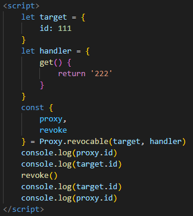

**ES6（ES2015）**

**全称ECMAScript 6.0，时JavaScript版本标准，2015.06发版**

**一、let和const**

let：声明变量，只在let命令的代码块内有效

不能重复声明：（let a = 1;let a = 2;），var可以声明多次

不存在变量提升（变量是undefined），var会变量提升（值是undefined）

const：声明常量，只在let命令的代码块有效，一旦声明常量值就不能改变

**二、解构赋值**

**对赋值运算符的扩展**

**解构的源，解构赋值表达式的右边部分**

**解构的目标，解构赋值表达式的左边部分**

**当目标有值时，就会赋值给源（变量）**

**数组模型的解构（Array）**

let [a,b,c] = [1,2,3]：基本解构 // a=1,b=2,c=3

let [a,[b,c]] = [1,[2,3]]：可嵌套 // a=1,b=2,c=3

let [a,  ,c] = [1,2,3]：可忽略 // a=1,c=3

let [a = 1, b] = []：不完全解构 // a=1,b=undefined

let [a, ...b] = [1,2,3]：剩余运算符 // a=1,b=[2,3]

let [a,b,c,d] = 'qwer'：字符串 // a='q',b='w',c='e',r='d'

let [a = 2] = [undefined]：解构默认值 // a=2

let [a = 3, b = a] = [] // a=3,b=3

let [a = 3, b = a] = [1] // a=1,b=1

let [a = 3, b = a] = [1,2]// a=1,b=2

**数组模型的解构（Object）**

let {a,b} = {a:'aaa', b: 'bbb'}：基本解构 // a='aaa',b='bbb'

`    `let {a:b} = {a:'bbb'} // b='bbb'

let obj = {p: ['hello', {y: 'world'}] }：可嵌套可忽略     let {p: [x, { y }] } = obj // x="hello",y="world"

`    `let {p: [x, {  }] } = obj // x="hello"

let obj = {p: [{y: 'world'}] }：不完全解构     let {p: [{ y }, x ] } = obj // y="world",x=undefined

let {a,b ...rest} = {a:10,b:20,c:30,d:40}：剩余运算符

`    `// a=10,b=20,rest={c:30,d:40}

let {a=10,b=5} = {a:3}：解构默认值 // a=3,b=5

let {a:aa=10,b:bb=5} = {a:3} // aa=3,bb=5

**三、Symbol**

原始数据类型Symbol，表示独一无二的值

const symbol1 = Symbol();

typeof symbol1 // symbol

const symbol2 = Symbol(42);

symbol2 === 42 // false

const symbol3 = Symbol('foo');

Symbol('foo') === symbol3 // false

let a = Symbol.for('aaa')

传入一个字符串，作为symbol注册表中的描述（相对于**创建**声明值 a的描述）

Symbol.keyFor(a) // "aaa"

获取全局symbol注册表中的关联键（相当于**查找**声明值 a的描述）

**方法**

for(key)：使用给定key在全局symbol注册表中创建新的symbol

keyFor(sym)：从全局symbol注册表中，为给定symbol检索共享的symbol key

只有检测到通过for注册的key，返回key值

**四、Map(weakMap)与Set**

**Map方法**

**Map对象保存键值对，任何值（对象或原始值）都可以作为一个键或一个值**

**Map和object的区别：**

**objec的键值个数需要手动计算，Map可以从size获取个数**

**object的键只能是字符串或symbols，但Map的键可以是任何值**

**objec的键没有顺序，而Map的键值时有序的**

**object有自己的原型，原型链上的键名可能和你在对象上设置的键名产生冲突**

new Map()：通过实例对象创建

set(key,value)：设置对象的key和value（key可以是对象，函数，NaN）

get(key)：按照key来获取对应的value

**Map迭代**：for...of：for(var [key, value] of Map)

` `forEach：Map.forEach((value,key)=>{})

**Map对象操作**：Map与Array转换：使用Array.from，转换成一个二维键值对数组

` `Map克隆：使用new Map(myMap)，构造函数生成实例，迭代出新的对象

` `Map合并：new Map([...first, ...second])，解构赋值，剩余运算符合并

**weakMap方法**

weakMap是Map的子集，”弱映射“，相对于Map的区别是，键只能是**Object**或继承自**Object**的类型，若不是Object类型的key，将抛出TypeError

原始值可以包装成对象，再作为key

如：new String('key')

**Set方法**

**Set对象允许你存储任何类型的唯一值，无论原始值或者是对象引用**

**Set对象存储值总是唯一的，对象之间引用不恒等，即时值相同也能存储**

new Set()：通过实例对象创建set对象

add(value)：存储值

o = {a:1, b:2}，add({a:1, b:2})：set能存储这两条数据

**类型转换：**Array转Set：new Set([arr1,arr2,arr3])

` `Set转Array： [...set]

` `String转Set：new Set('hello')

**作用：**去重：new Set([1,2,3,1,1,2])

` `并集：new Set([...a,...b])

` `交集：new Set([...a].filter(x => b.has(x)))：查找b集合有a集合的值

` `差集：new Set([...a].filter(x => !b.has(x)))：查找b集合没有a集合的值

**weakSet方法**

weakSet是Set的子集，“弱集合”，相对于Set的区别是，键只能是**Object**或继承自**Object**的类型，若不是Object类型的key，将抛出TypeError

原始值可以包装成对象，再作为key

如：new String('key')

**五、Reflect与Proxy**

reflect与proxy为操作对象引入的API[Reflect与Proxy.note](note://EBAFC845DD8E4FEBA665674978CE3AB3)

**六、字符串**

**方法**

includes(string)：返回boolean，判断是否找到**参数字符串**

startsWith(string)：返回boolean，判断**参数字符串**是否在字符串头部

endsWith(string)：返回boolean，判断**参数字符串**是否在字符串尾部

repeat(number)：将字符串**重复指定次数**

**字符串补全**

padStart(5,string)：返回新字符串，使用**指定长度**，**重复调用参数字符串**从头部补全原字符串

padEnd(5,string)：返回新字符串，使用**指定长度**，**重复调用参数字符串**从尾部补全原字符串

1、没有string参数用空格代替

2、长度等于原字符串，则返回原字符串

3、长度小于于原字符串 + 补全参数，则截取多余位数的字符

**模板字符串**

`string，${expression}`：表达式和变量和函数放入${}中，空格和换行都会保留

**标签模板**

alert`hello`  === alert('hello')

**七、数值**

**表示**

0b或0B：二进制表示法（0b11 === 3）

0o或0O：八进制表示法（0o11 === 9）

**常量**

Number.EPSILON：表示1与大于1的最小浮点数之间的差

0.1 + 0.2 === 0.3 // false

Math.abs（0.1-0.3+0.2）< Number.EPSILON

**最大/最小安全整数**

**安全整数，js无法精确表示整数，安全整数范围在2的53(-53)次方之间**

**最大安全整数：**

2的53次方-1

**最小安全整数：**

2的-53次方-1

**Nmuber新方法**

isFinite()：检测一个数值是否为有限（没有隐式转换(数据类型转换)）

parseInt()：从全局移植到number对象上的方法，将字符串或数字转换为指定位数整数

parseFloat(string/number)：同上，将字符串或数字转换为浮点数(无法解析返回NaN)

isInteger(value)：判断给定参数是否为整数

isSafeInteger()：判断数值是否在安全范围内

**Math方法的扩展**

**cbrt()：**计算一个数的立方根（非数值=NaN）

imul(number,number)：计算两个数的相乘

hypot(number...)：计算所有参数的平方和的平方根（true=1,false、null=0,非数值=NaN）

clz32(number)：返回数字的32位无符号整数形式的前导0的个数

**trunc(number)：**返回数字的整数部分(-0.5=-0,非数值=NaN)

fround(number)：获取数字的32位单精度浮点数形式

**sign(number)：**判断数字的符号（正、负、0）

expm1(number)：对数，计算e的x次方减1的结果===Math.exp(x) -1

log1p(number)：对数，计算1+x的自然对数===Math.log(1+x)

log10(number)：对数，计算以10为底的x的对数

log2(number)：对数，计算2为底的x的对数

指数运算符：（\*\*）右结合，从右至左计算

**八、对象**

**对象字面量**

const [age,name] = [12,'join']；const person = {age, name} // person = {age: 12}

sayHi() === sayHi:function()：方法面简写

\* sayHi() === sayHi:function\* ()：generator函数

["he"+"llo"]() === hello()：属性名表达式

**拓展运算符**

{...name, ...age}：取出所有参数对象所有可遍历属性然后拷贝到当前对象

{...name，name:'join'}：如果拓展元素符对象里面存在相同属性，后面的属性会覆盖前面的属性

**新方法**

assign(target,object2,object3)：将源对象所有可枚举属性复制到目标对象中(目标对象，源对象)

assign与...扩展运算符进行合并对象时的差别

文档：[JavaScript Object Spread (javascripttutorial.net)](https://www.javascripttutorial.net/es-next/javascript-object-spread/)

assign合并时，会调用合并对象的setter 属性属性；...不会访问

assign合并只读属性时，会报错；...不会报错，会把只读属性的值进行覆盖

is(value1,value2)：比较两个值是否严格相等(相当于===，NaN===NaN // false，而is返回true)

entries(value)：

处理值为数组时

Object.entries([1,2]) // [['0',1],['1',2]]

通过entries后，将数组每个值放入数组，形成二维数组

每个数组第一个值始终是’0‘，’1‘，’2‘，依次叠加

处理值为对象时：

Object.entries({user: 'name', pass: 'word'}) // [['user','name'],['pass',''word]]

通过entries后，将对象每个key，value放入数组，形成二维数组

fromEntries(value)：

与entries相反，将二维数组转换为对象

Object.fromEntries([[1,2]]) // {1: 2}

将二维数组的第一个值作为key，第二个值作为value

**九、数组**

**创建Array**

Array.of(values)：返回[values]

创建一个具有可变数量参数的新数组实例

Array.of(...numberArrs)：返回[values]

from(array，mapFn，thisArg)：

将类数组对象或可迭代对象转换为新的、浅拷贝数组，第二个参数对每个元素进行处理

mapFn：Array.from([1,2,3],(n)=>n \* 2) // [2,4,6]

thisArg：Array.from([1,2,3],(n)=>return this.do(n),map)

let map = {do(n){return n \* 2}} // [2,4,6]

第三个参数为mapFn指向执行的对象

**类数组对象**

from({0:1, 1:2, 2:3, length:3})：

// [1,2,3]，没有length属性，则返回空数组，属性名必须为数值，否则返回undefined

**可迭代对象**

**Map**

let map = new Map()，set('key0','value0'),set('key1','value1')

Array.from(map)： // [['key0','value0'],['key1','value1']]

**Set**

let arr = [1,2,3]；let set = new Set(arr)；Array.from(set)：// [1,2,3]

**字符串**

let str = 'abc'；Array.from(str)：// ['a','b','c']

**方法**

**查找**

arr.find(item => item > 2)：查找数组中符合条件的元素，若有多个元素，则返回第一个元素

arr.findIndex(item => item = 1)：查找数组中符合条件的元素，同上，则返回第一个元素索引

**填充**

fill(value，index，lastindex)：将**一定范围索引**的数组元素内容填充为单个指定的值

copyWithin(index,copyindex,copylastindex)：将一定范围索引的数组元素修改为另一指定范围索引的元素

[1,2,3,4].copyWithin(0,2,4)：// [3,4,3,4]

[1,2,3,4].copyWithin(-2,0)：// [1,2,1,2]

**遍历**

entries()：遍历键值对

for (let [key, value] of ['a', 'b'].entries())：[0, 'a'],[1, 'b']

let entries = ['a','b'].entries()；entries.next().value：// [0,'a'] [1,'b']

keys()：遍历键名，同上，返回键名

values()：遍历键值，同上，返回值

**包含**

includes(value,index)：数组是否包含指定值，第二个值为搜索索引

**嵌套数组转一维数组**

flat(number)：[1,[2,[3]]] // [1,2,3] 自动跳过空格，number指定转换数组层次

Infinity：该参数会转换所有嵌套数组层次

flatMap()：先对数组中每个元素进行处理，在进行flat()方法

flatMap(n => [n \* 2])

**数组缓冲区**

**数组缓冲区是内存中的一段地址**

**定型数组的基础**

**实际字节数在创建时确定，之后只可修改其中的数据，不可修改大小**

new ArrayBuffer(10)：通过构造函数创建

byteLength： 长度：// 10

slice(1,3)：长度 // 2

**视图**：用来操作内存的接口

可以操作数组缓冲区或缓冲字节的子集，并按照其中一种数值数据类型来读取和写入数据

DataView类型是一种通用的数组缓冲区视图，支持所有8种数值类型数据

new DataView(buffer)：通过构造函数创建

**方法**：

setInt8(0,1)：设置

getInt8(0)：获取 // 1

**定型数组**

**数组缓冲区的特定类型的视图**

**可以强制使用特定的数据类型，而不是使用通用的DataView对象来操作数组缓冲区**

new Int8Array(buffer)：通过数组缓冲区生成

new **Int32Array**(10)：通过构造函数，不传参数将分配不到空间

byteLength：// 40

length：// 10

可接受参数包括数组，可迭代对象(Set，Map)，数组，类数组对象

定型数组可用entries()，keys()，values()迭代

**扩展运算符**

**取出参数对象中的所有可遍历属性，拷贝到当前对象中，可以是放入到数组或对象**

**扩展运算符可用于浅拷贝**

let arr = [1,2] === [...arr] === [1,2]

[...[1,2],...[3,4]] // [1,2,3,4]

let obj = { a:1,b:2 }

{...obj} // { a:1,b:2 }

**十、函数**

**默认参数**

fn(name,age=16)：当调用参数第二个没传值时，使用默认参数

或者参数undefined时，使用默认参数

为**初始化赋值**的参数值无法作为其他参数的默认值

**不定参数**

fn(...values)：使用...表示不确定参数个数，返回参数数组

**箭头函数**

var f = x => x === var f = function(x){return x};

f(1)：当{}代码块中只有一行语句时，并且需要返回结果时，可以省略

var f = (a,b) => a+b

f(1,2)

当需要箭头函数返回对象时，为了区分代码块，要用()将对象包括起来

var f = (a,b) => ({a:a, b:b})：返回对象

箭头函数this指向外层this对象，可以使用对象包裹使用箭头函数

**箭头函数的this指向定义该函数时的上下文**

var Person1 = {     'age': 18,     'sayHello': function () {         console.log(this.age);     } };

**十一、迭代器**

**iterator：新的遍历机制，通过Symbol.iterator使用迭代器**

**迭代器用于遍历数据结构元素的指针**

**通过next方法进行迭代，返回当前为对象并指向下一个位置**

**返回值包含value（当前属性值），done（遍历是否结束）**

const items = ["zero", "one", "two"];     const it = items[Symbol.iterator]();

`    `it.next();

const items = ["zero", "one", "two"];     const it = items.entries()

`    `it.next(); // [0,‘zero’],[1,"one"]	// 返回数组的键值数组

const items = ["zero", "one", "two"];     const it = items.keys()

`    `it.next(); // [0,1,2]		// 返回数组的key的数组

const items = ["zero", "one", "two"];     const it = items.values()

`    `it.next(); // ["zero", "one", "two"]		// 返回数组的value的数组

可迭代的值：Array,String,Map,Set,Dom元素(正在进行中)

**还可以通过for...of进行遍历**

**for of 用于数组**

**只能let value of arr**

**for of 用于对象**

**可以let [key, value] of obj**

for...of用于替代for...in和forEach()

**十二、Class类**

**类作为对象的模板被引入，可以通过class关键字定义类**

**class本质是function，使原型更加清晰，更像面向对象编程的语法**

**定义**

匿名类：let example = class {}：匿名类

命名类：let example = class Example {}：命名类

类声明：class Example {}：类声明

**类不可重复声明，类定义不会提升，必须在访问前对类进行定义**

**主体**

prototype：**属性**，可以**添加方法**和属性

Object.assign(Example.prototype,{// methods})：可以**添加方法**，通过复制源对象到目标对象中进行添加

static a = 2：静态属性（暂不支持）

Example.a = 2（目前可行）

**static可以使函数或变量直接使用，不会被实例继承**

**class.a || class.a()可以直接使用class类中的静态方法或变量**

**父类的静态方法可以被子类继承，子类可以直接使用**

Example.prototype.a = 2：**公共属性**

let exam = class **Example：**通过exam.name获取class的名字（Example ）

**方法**

constructor()：**constructor方法是默认调用的方法**，创建类的**实例化对象**会默认调用方法

new Example()；

new Example instancof Example(类)：constructor**默认返回this对象**

**new Example的构造函数的property是否出现在 Example的原型链上**

static sun(a,b)；Example.sun(1,2)：调用静态方法

sun(a,b)；let exam = new Example()；exam.sun(1,2)：实例化对象调用**原型方法**传参

constructor(){this.sum = (a,b) => {console.log(a + b)}}：实例方法

**类的实例化**

**new 关键字，class的实例化必须通过new 关键字**

let exam1 = new Example(1,2)；let exam2 = new Example(3,1)

exam1.\_proto\_ == exam2.proto  // true 可以共享原型对象

exam1\_proto\_.sub = function() {return this.a - this.b}：调用constructor定义的属性

exam1.sub()：可以直接调用

**类修饰**

**decorator是一个函数，修改类的行为，在代码编译时产生作用**

@testable；

function testable(target){target.isTestable = true};

class Example();

Example.isTestable // true

例子添加了静态属性，若要添加实例属性，需要在类的prototype上操作

@writable;

function writable(target,name,descriptor) {descriptor.writable = false;return descriptor}

descriptor必须返回

target=类的原型对象，name=修饰的属性名，descriptor=该属性的描述对象

修饰器执行顺序，有多个修饰器时，由外向内进入，由内向外执行

**封装与继承**

getter/setter

set a/get a：类实例化时会调用set方法，但不会调用get方法

get方法不能单独出现，必须同级出现

**extends**

class Child extends Father {...}：通过extends实现类的继承

**super**

子类constructor方法必须要super()方法，比如使用了extends就需要使用super()

只能出现在子类构造函数中，constructor中

在普通方法中，super指向父类原型对象

**接收的参数，是实现父类的constructor的属性**

在静态方法中，super指向父类

constructor的this使用都必须在super后面

不能继承常规对象，只能定义class类

解决办法：Object.setPrototypeOf(Child.prototype, Father)

**十三、模块**

**之前实现模块化使用require**

**ES6的模块化分为export（导出）与import（导入）两个模块**

**模块自动开启严格模式use strict**

**模块可以导入或导出各种类型的变量，如函数，对象，字符串，数字，布尔值，类**

export{var1,var2,var3}：大括号指定输出一组变量，明确导出的接口

import {var1,var2,var3} from 'test.js'：引入对应的接口

在html中使用 引入

**as的用法**

export {var1 as name}：as重新定义了导出接口名称，import需要使用name定义别名

import {var1 as name}：as规定导出的接口名称，import需要使用的name定义的别名

**export default**

当只export一个变量时，可以使用export default ，不用使用{}，可以用import任意变量接收

**命名导出**export const bar = ‘小明’

**默认导出**export { bar }

**import()**

1、import('./export.js')，动态引入js文件，并且执行

**CommonJS（ES6之前的js模块化，但是只能用于nodejs）**

module.exports = {} // 输出模块

require()   // 引入模块

**十四、Promise对象**

**是异步编程的一种解决方案，promise是一个对象，可以获取异步操作的消息**

**状态有三种：pending（进行中）fulfilled（已成功）rejected（已失败），无法改变状态结果**

new Promise(resolve,reject)

resolve()：成功的返回值

reject()：失败的返回值

.then(res=>{})：通过.then来接收成功或失败的返回值

第一个参数接收成功的返回值

第二个参数接收失败的返回值

catch(err=> {})：对报错进行处理（throw new Error(value)）

finally()：无论失败还是成功都会调用

all([promise,promise1])：接收数组，接收promise对象实例，当所有成功或失败时才继续执行

如果有失败，会返回失败的值

不管成功失败，全部接收的话，可以在all()函数中使用以下方法

[a,b,c].map((item) => item.catch(e => e))会把错误先抛出，后面就不会再抛出catch错误

race([p1,p2,p3])：只要一个promise对象实例状态发生变化，就率先执行返回值

**十五、generator函数（生成器函数）**

**通过generator函数，使用yieid关键字，可以把函数的执行流挂起，为异步编程提供解决办法**

**通过yield暂停计算，并在未来某个时刻继续调用输出**

**generator函数与普通函数的区别：**

在function后面有个 \*

函数内部有yield表达式

yield [1,2,3]，可以是个数组，迭代将循环1，2，3并输出

**生成器函数中的方法：**

next()：调用相对应的yield值，返回{value：'值'，done：‘遍历是否结束’}

return(‘value’)：返回指定value，done为true，提前使遍历结束，之后的next将没有值

throw(err)：使用接收throw抛出的异常，使遍历提前结束

但是在生成器中处理了throw，通过try{}catch(e){}处理，将跳过此次迭代

再次调用迭代器，还会继续输出迭代值

function\* g1() {

`    `yield 2;

`    `yield 3;

`    `yield 4;

}

let arr = [2,3,4]

// yield\* [[expression]];

// expression：返回一个可迭代对象的表达式。

function\* g2() {

`    `yield 1;

`    `yield\* g1() || arr;

`    `yield 5;

}

let iterator = g2();

console.log(iterator.next());

console.log(iterator.next());

console.log(iterator.next());

console.log(iterator.next());

console.log(iterator.next());

console.log(iterator.next());

// { value: 1, done: false }

// { value: 2, done: false }

// { value: 3, done: false }

// { value: 4, done: false }

// { value: 5, done: false }

// { value: undefined, done: true }

**十六、async函数(ES7)**

**与异步操作有关的关键字，和promise，generator有很大关联**

**async function name（传递给函数的参数）{return 函数主体}**

**async函数总返回一个promise对象，使用then方法添加回调**

**在async函数中return的值，都会是promise对象**

**await关键字：**

**等待一个promise返回值，只能在async function内部使用，非promise对象直接返回对应值**

async function aa() {

let x = await new Promise(resolve => {resolve('ok')})

console.log(x) // ok

}

**ES7（ES2016）**

Array.prototype.includes()

arr.includes()

判断数组是否包含一个元素（和indexOf相似，但是可以识别NaN）

幂运算符\*\*

ES5使用Math.pow(2,53)

ES7直接使用2\*\*53

3 \*\*= 2（9）

**ES8（ES2017）**

async/await

是generator函数的语法糖

async函数内使用await，异步编程，必须等待await返回异步任务

Object.values()

返回可枚举对象的所有值，返回一个数组

Object.entries()

返回可枚举对象的键值对数组，返回一个数组

Object.getOwnPropertyDescriptors(obj, property)

枚举对象每个属性参数，属性值，是否可枚举

获取属性的描述符

尾逗号

允许函数接收参数使用尾逗号(a,b,c,)

**ES9（ES2018）**

for await (let item of arr)[ES9的for await of.note](note://EC43BCAF6F3E42889B99EAB13B974707)

` `针对for of，迭代都是同步任务启动

for await of，对迭代是异步执行

promise.prototype.finally()

不管promise什么状态都会执行的回调函数

对模板字符串的扩展

foo`/undfdfdf`;

es9以前报错

es9:[undefined, raw:['\undfdfdf']]

es9可以从raw上获取原字符串

**ES10（ES2019）**

Object.fromEntries()

和Object.entries正好相对，把保存在数组的二维数组键值对，转换为对象

把Map对数据保存对象，转换为普通对象

String.trimStart()

去掉字符串左边的空格

String.trimEnd()

去掉字符串右边的空格

Array.prototype.flat()

按照指定的胜读递归遍历数组，并合并到子数组中

arr.flat(number or infinity)

Array.prototype.flatMap()

实质和上面相同，多出一个map功能，循环数组元素处理单个元素，并且flat()

Symbol.description()

可以获取对应symbol的描述，定义的symbol

Function.prototype.toString()

返回一个函数的源代码

catch Building

es10允许在捕获异常时省略catch的参数

**ES11（ES2020）**

BigInt基本数据类型

js最大的取值范围是2的53次方

BigInt可以超出2的53次方

可选链

a?.b?.c?.d?.e其中的?表达式有值，就会继续查询问号后面的字段

合并运算符??

以前查询值会设置默认值（a || 1），但是当a等于0时，我们也期望输出0

那么（a ?? 1），a等于0时会输出0，只有a为null或undefined时会输出右侧1的值

Promise.all()

接收一个promise对象数组，返回一个对象，包含所有promise返回值

其中任何一个promise返回reject，就会停止运行

RegExp

matchAll()：必须接收一个带g标志的正则表达式，返回匹配到的可迭代器对象

function getPromise(time) {

`    `return new Promise((resolve, reject) => {

`        `setTimeout(() => {

`            `resolve(time)

`        `}, time)

`    `})

}

const asyncArr = [getPromise(1000), getPromise(200), getPromise(3000)]

async function test() {

`    `for await (let item of asyncArr) {

`        `console.log(Date.now(), item);

`    `}

}

test()

**Reflect**

操作对象的API（Reflect.has()）

通过反射机制，可以访问、检测和修改对象的内部状态与行为

方法

has(target,key)：对象是否存在对应的key

get(target,key)：获取对应对象的key值

set(target,key,value)：改变对象对象的key值

ownkeys(target)：返回对象的所有属性

deleteProperty(target,key)：删除对象的属性

construct(obj,[arguments])：相当于ner obj(arguments)

**defineProperty**(obj,symbol,descriptor)：在一个对象上直接定义一个属性，或者修改属性的值，并返回此对象

与Object.defineproperty作用相同，唯一不同的是返回true or false

defineProperties(obj,{

name: {

value: 2,

writable: true

},

...可枚举的属性描述符对象

})

直接在一个对象上定义一个或多个新的属性，或修改现有的属性

writable：该属性值可写吗

value：属性值

configurable：对应属性类型可以被改变，或着被删除

**Proxy**

操作对象的API（new Proxy(target,handler)）

相当于对对象的操作进行代理拦截，就是在访问对象前添加一层拦截，过滤操作

target：包装的目标对象(obj)

之后调用使用proxy调用属性

handler：对象，包含函数（当对proxy对象进行一些操作时，可以触发对应函数）

get(**target**,**key**,**proxy**)：参数为obj、key

获取对象的属性时触发

拦截

proxy.property

Reflect.get

set(**target**,**key**,**value**,**proxy**)：参数为obj、key、value

设置对象属性时触发

拦截

proxy.property = value

Reflect.set

has(target,key)：并使用in操作符的代理方法

是否存在对象的属性

拦截

property in proxy

Reflect.has

defineProperty:(target,prop,descriptor)

对定义属性或更改属性进行拦截

拦截Object.defineProperty

拦截Reflect.definpRroperty

拦截obj.property = 'value'

对以上方法可以进行拦截

此方法必须返回true，来表明是否操作成功

deleteProperty:(target,prop,descriptor)

对定义属性或更改属性进行拦截

拦截Reflect.deleteProperty

拦截delete proxy[key]

对以上方法可以进行拦截

此方法必须返回true，来表明是否操作成功

进行拦截后以上的修改属性，删除属性将无效，需要在proxy拦截方法里操作

getOwnPropertyDescriptor(target, property)

访问proxy对象的属性描述符

拦截

Object.getOwnPropertyDescriptor(target,property)

Reflect.getOwnPropertyDescriptor(target, property)

ownkeys(target)

访问对象的proxy的key

拦截

Object.keys(proxy)

Object.getOwnPropertyNames(proxy)

Reflect.ownKeys(proxy)

getPrototypeOf()

访问proxy原型时触发，访问拦截对象的原型

拦截

Object.getPropertyOf(proxy)

Reflect.getPropertyOf(proxy)

setPrototypeOf()

设置proxy原型时触发

拦截

Object.setPropertyOf(proxy, object)

Reflect.setPropertyOf(proxy, object)

**可撤销的代理**

const { proxy,revoke } = Proxy.revocable(target, handler)

revocable返回两个对象---proxy，revoke

调用revoke()可撤销target的代理

1

**Object**

**defineProperty**(obj,symbol(key),descriptor)：在一个对象上直接定义一个属性，或者修改属性的值，并返回此对象

writable：该属性值可写吗

`  `为**false**时，无法修改value的值

value：属性值

configurable：对应属性类型可以被改变，或着被**删除**

为**false**时，使用delete obj.key，将会**无效**

enumerable: 表示能否for循环此对象

为**false**时，比如使用Object.keys(obj)，返回的将会是空数组【】

get:()：当对象属性被读取时触发

set:()：当对象被赋值时触发

数据属性描述符
