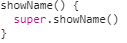
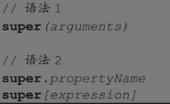

# JavaScript Proto

::: v-pre
`JavaScript 原型的意义在于实现继承功能，为了搞懂内部实现可参考下图的相互引用`
:::

## 原型
::: info
JavaScript 被描述为一种**基于原型的语言**，每个对象拥有一个**原型对象**，对象从原型继承方法和属性。  

原型对象也可能拥有原型，并从中继承方法和属性，一层一层、以此类推，这种关系常被称为**原型链**。  

在 JavaScript 的**对象实例**和**它的构造器**之间建立一个链接，它就是__proto__属性，是从**构造函数**的**prototype**属性派生的。  

获取原型，可以通过 **Object.getPrototypeOf(obj)** 或者已被弃用的__proto__属性获得。
:::

每当创建一个函数或对象时，**浏览器会自动**为这个函数或对象**创建一个\_\_proto\_\_对象**，随之函数的**constructor**等属性

constructor构造函数在创建出来的时候系统又会**自动创建一个空对象**：**prototype（原型）**

这个**函数**的**prototype**属性指向（ === ）函数的**实例原型对象（构造函数相同）**

constructor默认和prototype原型相关联

原型对象属于公共区域，所有基于这个函数对象的实例都可以访问这个原型对象

可以将函数或属性添加到prototype上

**什么是原型链**

对当前函数作用域对象进行**寻找某个属性或方法时**，**会先在自身\_\_proto\_\_查找**，如果没有查找到，**会进一步到constructor->prototype**中**查找**对应的方法或属性

Object.prototype中查找相关方法或属性，如果没有返回undefined

**每个对象拥有一个原型，每个原型也可以拥有一个原型，以此类推，形成一个原型链**

**如何在原型上添加属性和方法**

需要对函数的prototype进行绑定，**最后必须实例化函数**，进行对原型的复制，从而调用

通过new 方法其实是：

创建一个空对象

把构造函数的prototype赋值给了空对象的\_\_proto\_\_

并把构造函数运行时的this指向给创建的空对象

最后把这个空对象赋值给所声明变量

创建另一个空对象，存储构造函数的原型，并且运行构造函数，但使构造函数的this指向为空对象，最后返回空对象进行赋值。这样就创建了新的对象并拥有构造函数的原型的属性和方法。

**对原型链上新增或创建方法和属性**

可以使用上面new 操作符进行操作赋值

可以使用Object.create(obj)操作，会在新对象的\_\_proto\_\_上创建和obj一样的属性和方法

方法创建一个新对象，使用现有的对象赋值给新创建的对象的\_\_proto\_\_

let o = {}

o.x = 1

let p = Object.create(o)

p.y = 2

let z = Object.create(p)

z

// -> 会将对象的属性和方法放入新对象的额\_\_proto\_\_上

{}

`    `\_\_proto\_\_: 

`        `y: 2

`        `\_\_proto\_\_: 

`            `x: 1

`            `\_\_proto\_\_: 

`                `Object

**小结**

每个对象都有object.prototype，会指向原型链顶端，如果在原型链找不到对应的属性或方法，就会停止，返回undefined，可以直接在对象

**比如new Array()创建的对象以Array.prototype为原型**

两个对象最常用的方法是通过new 关键字对构造函数调用赋值给另一个对象，另一个对象的原型链拥有赋值对象的原型上的所有属性和方法

当然可用Object.create(obj,**prop**)，可以将对象的prototype赋值给声明对象的原型链上

这样的好处不会出现constructor和prototype的引用

prop的作用是对obj的描述，如{jumps:{value:true}}，可以是多个描述

会赋值给Object.create对应的对象中，增加一个jumps:value的属性与值

**2020-10-24**

object通过\_\_proto\_\_ = object2

object的原型拥有object2的所有方法和属性

相当与object拥有object2的方法，也可以说是继承了object2的所有属性和方法

**注意点，那么object2中的this指向的是哪里？**

this指向object中

**JavaScript类**

class Myclass定义一个类，需要通过new Myclass使用

new 会自动调用constructor，所以可以在constructor中初始化属性或对象

new Myclass("value")

实例化类时传入的参数，会自动触发class中的getter，setter函数

**类是一种函数**

extends

class User extends f("Hello") {}

不仅可以继承另一个类，还可以继承函数，并且传参

**方法的重写**

其实就是通过super调用父类的方法

如果继承中重写方法，使用箭头函数，其实会找到父类的上下文中函数

**constructor的重写**

继承类的构造函数，必须使用super()关键字调用

当**子类没有构造函数**时，**实例化**中的**传参**，会去**寻找父类的构造函数**，**并且调用**

但是，**函数**却不一样，同样的子类没有构造函数，**调用子类的函数方法**

会去寻找**父类的构造调用的方法是否调用**

如果调用：会执行子类的相同方法

如果子类没有父类一样的函数，则会调用父类的函数

**这类似于，继承中，方法的重写**

static

静态方法

可以直接.createTodays()调用对应方法，不需要实例化类

这里new this，实例化本身，相当于自调用赋值

mixin

包含其他类的方法的类，相当于多重继承，但是JavaScript不支持多重继承

可以使用将方法拷贝到类的原型中，以实现mixin

Object.assgin(User.prototype,obj)

此方法将对象obj中的方法和属性拷贝到User类的原型中，当new User后

prototype中的原型和方法，将会赋值到\_\_proto\_\_原型链中

以此实现多个对象的继承

当存在**实例方法**和**原型方法同名时**，实例方法会重写覆盖原型方法

继承

原型继承

类继承

super

**不使用继承，super指向该对象**

**使用继承，super指向父类构造函数**

**示例**

**继承后super调用父类方法，静态方法，this都指向当前实例或类**

**只有构造函数中的super()的this指向为父类**

实例化时传入的参数，可以选择传递给父类，使用方法调用

但是通过继承，实例化的类拥有父类的属性和方法，当然也可以重写属性、

封装

实例化

new.target，检测该函数或构造方法是否被new 运算符调用过，如果调用过，返回类或函数本身构造函数，否则为undefined。如下图：**检测该类是否被实例化，可以防止类被实例化**

