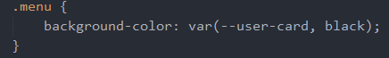
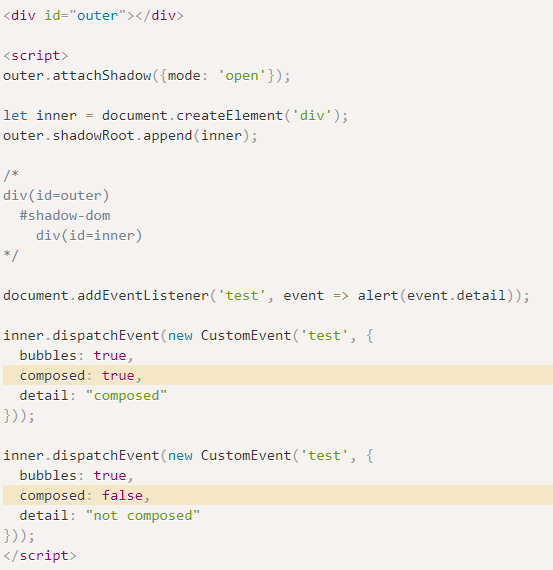

**custom elements**

可以通过描述带有自己的方法、属性、事件等的类来创建自定义HTML元素

自定义标签完成之后，可以正常在HTML中使用

**Autonomous custom elements（自定义标签）**

全新的元素，继承自**HTMLElement**抽象类

元素生命周期


**示例**

**<my-element first="123">123</my-element>**

```
<script type="text/javascript">

**class MyElement extends HTMLElement** {

// constructor() {

//  super()

// }

**connectedCallback**() {

console.log('元素已被添加到文档')

}

**disconnectedCallback**() {

// 该元素被删除DOM=>removeChild(ele)等

console.log('元素从文档移除')

}

**static get observedAttributes**() {

// 该元素的属性数组，这些属性会被监视

return ['first']

}

**attributeChangedCallback**(name, oldValue, newValue) {

// ele.setAttribute(attr,value)

// 当被监视的属性值发生变化时，该方法会被调用

}

**adoptedCallback**() {

console.log('当元素被移动到新文档的手')

}

}

// 定义和注册主定义元素，用来显示在HTML文档上

**customElements**.**define**('my-element', MyElement)

</script>
```
**Customized built-in elements（自定义内置元素）**

继承**内置的HTML元素**，比如**自定义HTMLButtonElement**等

示例

<script> // 这个按钮在被点击的时候说 "hello"，该自定义元素继承自HTMLButton元素 class HelloButton extends HTMLButtonElement {   constructor() {     super();     this.addEventListener('click', () => alert("Hello!"));   } } // 注册一个hello-button的元素，指定元素构造器，可选：继承已创建的元素（拥有其属性和方法） customElements.define('hello-button', HelloButton, {extends: 'button'}); </script>

// is属性允许您指定标准HTML元素像自定义的内置元素一样工作

// 只有在当前文档中成功定义(define)指定的自定义元素名称，

// 并且(extends)扩展了要应用的元素，才能使用is属性   <button is="hello-button">Click me</button>   <button is="hello-button" disabled>Disabled</button>

**customElements**

该接口提供注册自定义元素和查询已注册的元素的方法

define(name,constructor,option:{extends: 'element'})：定义一个新的自定义元素

get(name)：返回指定自定义元素的构造函数

whenDefined(name)：当元素被定义时，接口返回一个成功的promise

**Shadow DOM**

shadow dom为封装而生，它可以让一个组件拥有自己的shadow dom树

该dom树不能再主文档中被任意访问，可以拥有自己的局部样式和其他特性

**shadow host**：一个常规DOM节点，shadow DOM会被附加到这个节点上

**shadow tree**：shadow DOM内部的DOM树

**shadow boundary**：shadow DOM结束的地方，也是常规DOM开始的地方

**shadow root**：shadow tree的根节点

**shadow tree**

**eleRef**.**attachShadow**(shadowRootInit)

eleRef：必须是能容纳shadow tree的元素

shadowRootInit：一个shadowRootInit字典（创建一个shadow tree）

{mode: open}：shadow rout元素可以从js外部访问根节点

可以通过**elem.shadowRoot(相当于document节点)**访问shadow tree

{mode: closed}：拒绝从js外部访问关闭的shadow root节点

不可以通过**elem.shadowRoot**访问shadow tree，永远是null


自定义的my-ele元素会将它的内部DOM隐藏在影子中，不会显示

不会被**document**文档所找到

只会在ele.**shadowRoout**节点中找到

shadow中的DOM元素将会插入到my-ele元素中

elem.shadowRoot.host === elem（true）

表示attachShadow({mode：‘open’})；否则为false

**slot**

slot插槽，使元素更加灵活

**具名插槽**


通过shadow DOM的shadowRoot中使用slot

shadow DOM中提供了两个slot插槽，并且定义name=“mytext”的插槽点名称

元素使用slot=“mytext”属性与属性值对应定义的插槽，匹配成功将会把该元素渲染到对应插槽中

**默认插槽**


shadow DOM中slot不定义name名字，则是不具名的插槽

将会把元素中所有没有slot属性的元素渲染到插槽中


创建template，将模板作为shadow Dom的内容

**将自定义元素中的内容都渲染到插槽点中**，点击指定元素，实现动态添加删除样式

**shadow样式**

:host选择器允许选择shadow宿主（包含shadow树的元素）


:host：作用在**整个shadow宿主节点**

:host([centered])：作用在与**shadow宿主属性相匹配时**才应用样式

:host-context(.dark)：只有在**shadow宿主**或**它外部祖先元素**有**对应的样式**才会生效

**插槽样式**

对slot本身元素进行样式化，并影响子元素


使用::slotted(ele)，只能对插槽插入的对应元素进行渲染（不能用于更深层次的节点）


使用自定义css属性进行样式穿透（外部元素声明的样式，会用于内部插槽的样式）




**shadow事件**

shadow dom具有冒泡事件、事件委托等

如果是自定义事件，需要定义自定义事件的bubbles和composed



只有composed为true，才会允许事件可以从shadow DOM传递到一般的DOM

**template**

是一种用于**保存客户端内容机制**，该内容在加载页面**不会呈现**

将模板视为一个**可存储在文档中**以便**后续使用的内容片段**

template不会在文档中显示，除非被插入使用

template的content属性可看作DocumentFragment相当于一个DOM包装器片段

可以随时插入node节点（如append()、insertBefore()）


template中的元素也会被添加到shadow DOM中，并且生效

开发复杂软件的原则：不要让软件复杂

当某个部分复杂了，就将其拆分为简单的部分，再以简单的方式组合起来

**只有让复杂的事情简单化的架构才是好架构**


