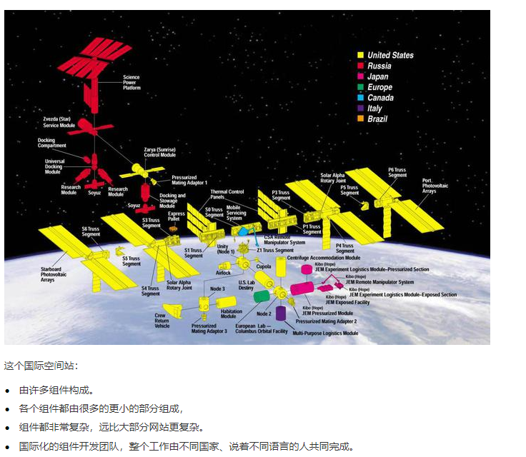

# JavaScript Web Components
## Custom Elements
:::info 简介
自定义元素  
允许您定义 custom elements 及其行为，然后可以在您的用户界面中按照需要使用它们  
自定义标签完成之后，可以正常在HTML中使用
:::
- Autonomous custom elements (自定义元素)

```html
<my-element>myElement!</my-element>
```

```js{1,2}
// Custom Elements 继承自 HTMLElement 抽象类
// 创建 自定义元素 可在元素生命周期中执行相关操作
class MyElement extends HTMLElement {
    constructor() {
        super()
        this.style.color = "red";
    }
    // 自定义元素第一次被连接到文档 DOM 时被调用
    connectedCallback() { console.log('元素已被添加到文档') }

    // 自定义元素与文档 DOM 断开连接时被调用，如元素被删除 ele.remove()
    disconnectedCallback() { console.log('元素从文档移除') }

    // 自定义元素的所监听的属性被增加、移除或更改时被调用，如 ele.setAttribute('first', 'value')
    attributeChangedCallback(name, oldValue, newValue) {}

    // 返回元素的属性名数组，这些属性变化会被监视
    static get observedAttributes() {
        return ['first']
    }
    // 自定义元素被移动到新文档时被调用
    adoptedCallback() { console.log('当元素被移动到新文档的时') }
}
// 定义和注册自定义元素(其中必须要有短横线)，用来显示在HTML文档上
customElements.define('my-element', MyElement)
// 返回以前定义自定义元素的构造函数
customElements.get('my-element');
// 当元素被定义时，接口返回一个成功的promise
customElements.whenDefined('my-element');
```
- Customized built-in elements (自定义内置元素)

```html
<button is="my-button">click!</button>
<p is="my-p">This is p!</p>
```

```js
// 继承自 HTMLButtonElement，并扩展该元素
class MyButton extends HTMLButtonElement {
    constructor() {
        super()
        // this.disabled = true
        this.addEventListener('click', (event) => console.log("Hello!"))
    }
}
// 继承 button 元素，拥有 button 元素所有属性
customElements.define('my-button', MyButton, { extends: 'button' })

// 继承自 HTMLParagraphElement，并扩展该元素
class MyP extends HTMLParagraphElement {
    constructor() {
        super()
        this.style.color = 'red'
    }
}
// 继承 p 元素，拥有 p 元素所有属性
customElements.define('my-p', MyP, { extends: 'p' })
```
## Shadow DOM
:::info 简介
影子 DOM  
shadow dom为封装而生，它可以让一个组件拥有自己的shadow dom树  
可封装的 `影子DOM树` 附加到元素（与主文档 DOM 分开呈现）并可控制其关联的功能  
可保持元素的功能私有，私有化脚本和样式，而不用担心与文档的其他部分发生冲突
:::
```html
<popup-info data-text="this is title!"></popup-info>
```
```js
// 创建自定义元素
class PopUpInfo extends HTMLElement {
    constructor() {
        super();
        // 创建 shadow root
        // { mode: open }: shadow root元素可以从 js 外部访问根节点，是shadow tree
        // { mode: closed }: 拒绝从 js 外部访问关闭的shadow root节点，永远是null
        const shadow = this.attachShadow({ mode: "open" });

        // 创建span
        const info = document.createElement("span");
        // 获取属性内容并将其放入文本中
        const text = this.getAttribute("data-text");
        info.setAttribute("class", "info");
        info.textContent = text;

        // 创建img
        const img = document.createElement("img");
        img.src = "./docs/assets/aperture.svg";

        // 创建一些style应用到 shadow dom
        const style = document.createElement("style");
        style.textContent = `
            .info {
                font-size: 0.8rem;
                width: 200px;
                display: inline-block;
                border: 1px solid black;
                padding: 10px;
                background: white;
                border-radius: 10px;
                opacity: 0;
                transition: 0.6s all;
                position: relative;
                bottom: 20px;
                left: 0px;
                z-index: 3;
            }
            img {
                width: 1.2rem;
            }
            img:hover + .info {
                opacity: 1;
            }
        `;
        // 将创建的元素附加到shadow dom
        shadow.append(style);
        shadow.append(img);
        shadow.append(info);
        // ShadowRoot 附加的宿主 DOM 元素，popup-info元素。
        shadow.host;
        // ShadowRoot 内部的 DOM 树
        shadow.innerHTML;
    }
}
// 注册自定义元素
customElements.define('popup-info', PopUpInfo);
```
## Templates and Slots
:::info 简介
HTML 模板  
`<template />` 和 `<slot />` 元素使您可以编写不在呈现页面中显示的标记模板

`<template />`是一种用于保存客户端内容机制，该内容在加载页面不会呈现  
将模板视为一个可存储在文档中以便后续使用的内容片段
1. template不会在文档中显示，除非被插入使用
2. template的content属性可看作DocumentFragment相当于一个DOM包装器片段
3. template中的元素也会被添加到shadow DOM中，并且生效
:::
```html
<!DOCTYPE html>
<html>
  <body>
    <!-- 使用自定义元素 -->
    <my-ele myELeClass>
      <!-- 定义元素内容 -->
      <h1>h1</h1>
      <h2>h2</h2>
      <span slot="myText">Let's have some different text!</span>
      <h1 slot="myText2">Let's have some different text!</h1>
    </my-ele>
    <!-- 定义模版，将模板作为shadow dom的内容 -->
    <template id="template">
      <!-- 定义默认插槽、具名插槽 -->
      <slot></slot>
      <slot name="myText"></slot>
      <slot name="myText2"></slot>
      <style>
        :host {
          background: rgb(239, 131, 59);
          user-select: none;
        }
      </style>
    </template>
    <script>
      class myEle extends HTMLElement {
        connectedCallback() {
          // 定义shadow后，内容只能挂在到shadow上
          let shadow = this.attachShadow({ mode: "open" });
          let template = document.getElementById("template");
          // 模版使用方式一，将元素内容放入template中
          // this.shadowRoot.innerHTML = template.innerHTML;
          // 模版使用方式二
          this.shadowRoot.append(template.content.cloneNode(true));

          // 改变元素样式
          this.shadowRoot.querySelector('slot[name="myText"]').onclick = (
            event
          ) => {
            event.target.style.color = "red";
          };
        }
      }
      customElements.define("my-ele", myEle);
    </script>
  </body>
</html>
```
参考链接：https://developer.mozilla.org/zh-CN/docs/Web/Web_Components  
## 组织化架构
::: info 简介
开发复杂软件的原则：不要让软件复杂  
当某个部分复杂了，就将其拆分为简单的部分，再以约定的协议、简单的方式组合起来  
`只有让复杂的事情简单化的架构才是好架构`
:::


