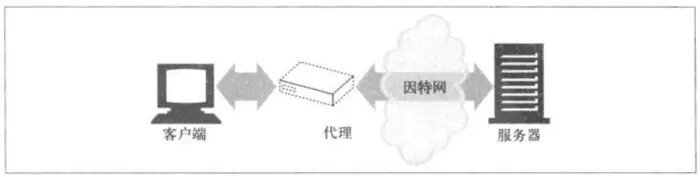
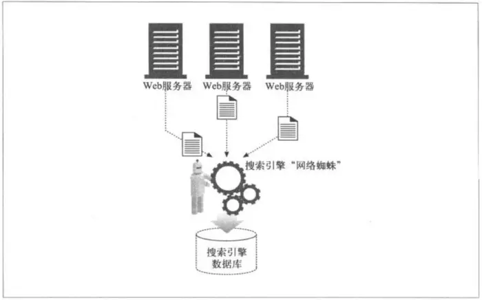

# Web 结构组件
## 代理
:::info 简介
1. 代理客户端和服务器之间的HTTP中间实体
2. 接收代理客户端的请求，( 可以修改后 ) 并转发给服务器
3. 也可以接收服务器返回的响应，( 可以修改后 ) 转发给客户端  

:::

## 缓存
:::info 简介
1. HTTP仓库，常用页面的副本可以保存在离客户端更近的地方
2. 第一次请求资源时，服务器返回资源，并在代理处缓存常用文档复制保存
3. 第二次请求资源时，会看看代理缓存是否存在缓存，如果有“请求资源”的副本，就直接从代理缓存中提取

:::

## 网关
:::info 简介
1. 连接其他应用程序的特殊Web服务器
2. 网关会将HTTP请求转换为其他协议与服务器进行连接，可以转换协议
3. 进行网络连接加密

:::

## 隧道
:::info 简介
1. 对HTTP通信报文进行盲转发的特殊代理
2. 用途是通过HTTP连接承载加密的安全套接字层（SSL）流量

:::

## Agent代理
:::info 简介
1. 发起自动 HTTP 请求的半智能 Web 客户端
2. 所有发布Web请求的应用程序都是HTTP Agent代理

:::