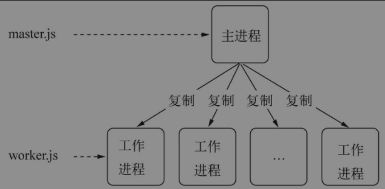

# Node 进程

## 服务模型
1. 同步（进程 = 1）
   1. 一次只为一个请求服务，所有请求按次序等待服务
   2. 请求执行非常缓慢，无并发
   3. QPS = 1/N
2. 复制进程（进程 = M）
   1. 复制N个进程，一个进程一次处理一个请求服务
   2. 请求执行消耗大量内存，一旦并发过高，随着进程增多导致内存耗尽
   3. QPS = M/N
3. 多线程（进程 = L，线程 = M）
   1. 将一个进程拆分为多个线程，线程之间可以共享数据
   2. 与复制进程相比，节约了内存资源
   3. Apache就是采用多线程/多进程，但当并发上万时内存耗用则会暴露出来
   4. QPS = L * M/N
4. 事件驱动
   1. 由于单进程、单线程的原因，请求趋于稳定性
   2. 影响事件驱动服务模型性能的点在于CPU的计算能力
   3. CPU的上限决定了事件驱动服务模型性能的上限
   4. 不受内存资源的上限，可伸缩性比前两者较高
## 多进程架构
1. 在理想状态下，每个进程各自利用一个CPU，以此实现多核CPU的利用
2. 在Node中提供了child_process模块，实现进程的复制
3. 主从模式（Master-Worker）
   1. 这是典型的分布式架构中用于并行处理业务的模式
   
   2. 每个进程都有独立的V8实例，启动需要30毫秒和至少10M的内存
   3. 这里启动多个进程只是为了充分将CPU资源利用起来，并不是为了解决并发问题
4. 使用child_process创建子进程
   1. spawn：启动一个子进程来执行命令
   2. exec：启动一个子进程来执行命令，拥有一个回调函数获知子进程状况
   3. execFile：启动一个子进程来执行可执行文件
   4. fork：启动一个子进程，只需指定要执行的JavaScript文件模块即可
5. 进程间通信
   1. 通过process监听child_process创建的子进程发送的消息
   2. 在创建child_process时，父进程在实际创建子进程之前，会创建IPC通道并监听它
## 集群
1. 一组独立的计算系统构成一个松耦合多处理系统，之间通过网络通信实现消息传送
2. Node的一组子进程构成了集群，通过上面的主从模式并行处理业务
3. 进程事件
4. 自动重启
5. 负载均衡
6. 状态共享
## Cluster（Node集群）
1. 使用cluster可以更容易的实现集群
2. cluster模块就是child_process模块和net模块的组合应用
3. 采用主从模式处理业务