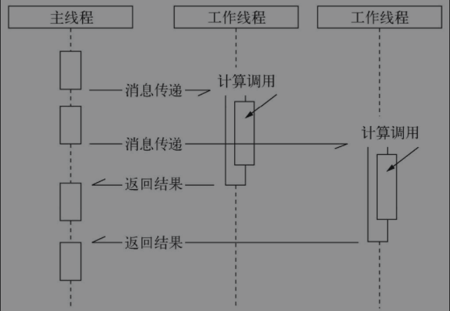

# NodeJs 异步编程

## 异步I/O
- 基于事件驱动的非阻塞I/O模型
- 异步I/O调用

## 同步I/O
- 同步I/O调用

## 特点
1. 异常处理
   1. 对异步API的执行，try/catch无法捕获
2. 函数嵌套过深
   1. 回调函数中的回调函数
3. 阻塞代码
   1. 由于Node是单线程事件循环，当阻塞代码出现，将会影响之后的业务逻辑
4. 多线程编程
   1. 由于Node是单线程的，无法享受到多核CPU的好处
   2. 使用web sorkers，可以很好利用多核CPU为大量计算服务

异步转同步
解决方案
事件发布/订阅模式
Node自身的events模块，是事件发布/订阅模式的一个简单实现
不存在事件冒泡等，通过事件监听触发方法实现
addListener/on()
监听/侦听事件
emit()
发布事件
once()
侦听一次
removeListener()
移除侦听事件
removeAllListener()
移除所有的侦听事件
promise/deferred模式
promise操作只会处于3种状态的一种：未完成状态、完成状态、失败状态
状态只会从未完成状态->完成状态/失败状态
状态一旦转化，将不能被更改
流程控制库
尾触发与next
通过next手动调用，触发函数流程

async模块（流程控制库）
串行执行：async.series([function, function], function(err, result))
将异步回调，组成一组任务串行执行，避免了无限回调的存在
并行执行：async.parallel([function, function],function(err, result))
将一组任务并行执行，同时调用数组中的函数
串行执行(能够传递上一个函数的参数)：async.waterfall([function, function], function(err, result))
和series一样，但是该waterfall方法
能够将参数传入回调函数，下一个函数能够在形参中接收
通过callback(err, content)传递
step模块（流程控制库）
串行执行(能够传递上一个函数的参数)：step(function, function, function done(err, content))
如：fs.readfile('file.txt', 'utf-8', this)通过this传递，将异步调用的结果传递给下一个任务
并行执行：step(function, function done(err, content))
如：fs.readfile('file.txt', 'utf-8', this.parallel())通过this.parallel()传递，告诉step，需要等待所有任务完成时才进行下一个任务
this.group()，与this.parallel()相似，区别在于返回结果，是存入在数组中