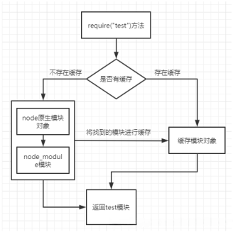

# NodeJs

:::info 简介
读取《Node 深入浅出》后的总结  
NodeJs 是一个基于Chrome V8引擎的JavaScript运行环境
1. 非阻塞异步I/O
2. 事件驱动/回调函数
3. 单线程
4. 跨平台
:::

## 模块机制
### commonJS模块化
```js
// math.js
exports.add = function () {
  console.log("hello");
};

// or

module.exports = {
  add: function () {
    console.log("hello");
  },
};

// index.js
var math = require("./math");
math.add();
```
### 模块的实现
1. **路径分析**
   1. 通过文件路径或名字获取模块的引用
   2. 优先从缓存加载（之前 require 的模块会被缓存，再次引入优先加载缓存模块）
   3. **Node核心模块**: `require('http')`，此为 Node 内置模块
   4. **node_modules模块**: `require('build-zip')`，Node将试图去当前目录的node_modules文件夹里搜索
   5. **文件模块**: `require('/home/base/my_mod')` or `require('./my_mod')`
      1. require导入文件时，如果不添加后缀名，则会按照.js，.json，.node等的顺序添加
   6. **文件目录模块**: `require('./folder')`
      1. 如果folder目录里没有包含package.json文件
      2. Node会假设默认主文件为index.js，即会加载index.js，如果index.js也不存在， 那么加载将失败
   7. **自动缓存已载入模块**: 对于已加载的模块Node会缓存下来
```js
// math.js
console.log("init");    // 只执行一次
module.exports = {
  add: function () {
    console.log("hello");
  },
};

// index.js
var math = require("./math");
var math1 = require("./math");
math.add();
math1.add();
```



2. **文件定位**
   1. **文件路径分析**
      1. 文件二次引入不需要路径分析，读取缓存
      2. 文件名不包含扩展名的情况下，Node会按照`.js`、`.json`、`.node`的次序补充扩展名，依次尝试
      3. 在尝试的过程中，还会调用fs模块同步阻塞地判断文件是否存在，Node是单线程的，所以这里会引起性能问题，因此对`.node`和`.json`等文件，需要在require时加上`扩展名`
   2. **目录分析和包**
      1. 在require()通过分析文件定位分析，可能没有对应文件，确定位到一个目录，此时Node会将目录当做一个包来处理
      2. 首先，Node会在该目录查找package.json通过JSON.parse()即系包描述对象，从中取出main属性指定的文件名进行定位，如果文件名缺少扩展名，又会进行补充扩展名分析步骤
      3. 如果main属性指定错误，或者根本没有pakeage.json文件，Node会默认将index当做模块文件名，然后依次查找index.js、.json、.node
3. **模块编译**
   1. 每个文件模块都是一个对象
      1. `.js`: 通过fs模块同步读取文件后编译执行。
      2. `.node`: 这是C/C++编写的扩展文件，通过dlopen()方法加载最后编译生成的文件
      3. `.json`: 同过fs模块同步读取文件后，用JSON.pares()解析返回结果
      4. `其他扩展名文件`: ，都当作.js文件载入
   2. 每个编译成功的模块都会将文件路径作为索引缓存在Module._cahce对象上，以提高二次引入的性能
    3. Node对每个模块文件包装了一层函数，进行作用域隔离，因此模块中会有`以下参数存在`
    ```js
    (function (exports, require, module, __filename, __dirname) {
       var math = require(‘math‘);
       exports.area = function(radius) {
          return Math.PI * radius * radius;
       }
    })
    ```
## 异步I/O与非阻塞I/O
## 非I/O的异步API
## 事件驱动