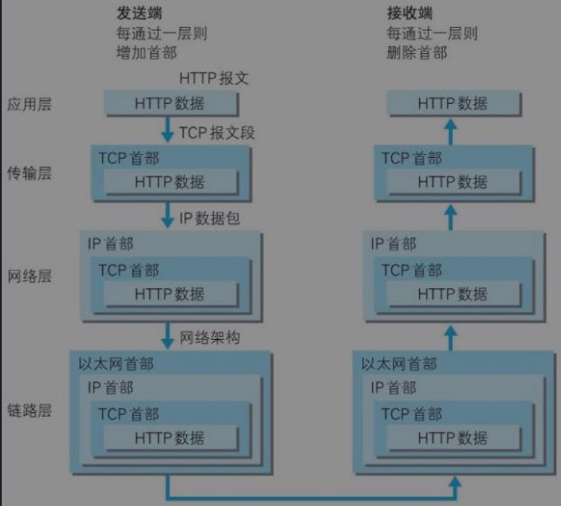
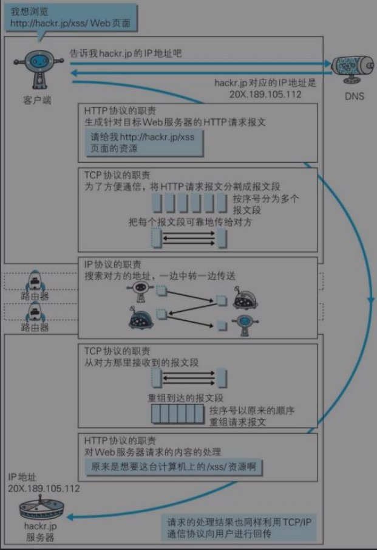

# Http Basics
## 网络模型
:::info 简介
首先我们来看几张图，了解下网络的模型结构  
国际标准 OSI模型 有7层结构，广泛应用的 TCP/IP模型 可以分为5层/4层结构  

  
  


这里主要分析 TCP/IP模型 4层结构
:::

## URI
:::info 简介
URI（**统一资源标识符**）用于标识某一互联网资源名称的字符串  
URI是一种抽象宽泛的定义。即，不管用什么方法表示，只要能唯一标记某个资源，它就叫URI  
通常已http:、ftp:、mailto:、file:，和协议对应的内容所构成  

- URL（**统一资源定位符**）用于标识某一互联网资源名称的字符串，URL是URI的一个子集  
  - 比如：http://www.aspxfans.com:8080/news/day01/index.asp?boardID=5&pwd=24618&page=1#name  
    - 协议部分 http:            (浏览器协议)
    - 域名部分 www.aspxfans.com (通过DNS转换为IP，识别主机服务器)
    - 端口部分 :8080            (识别主机的对应进程)
    - 目录部分 /news/day01/     (资源路径)
    - 文件部分 index.asp        (查找的对应文件)
    - 参数部分 boardID=5&pwd=24618&page=1 (参数)
    - 锚定部分 name             (#指定了网页中的一个位置)
:::
参考链接：https://developer.mozilla.org/zh-CN/docs/Learn/Common_questions/What_is_a_URL

## 应用层-HTTP
:::info 简介
HTTP（**超⽂本传输协议 HyperText Transfer Protocol** ）  
每个 HTTP请求都是⽆状态的，可以把 HTTP的⼀次请求当作⼀次事务  
HTTP是应⽤层通信协议，旨在在联⽹设备之间传输信息，HTTP标准化了客户端和服务器之间的通信⽅式  
HTTPS：在 HTTP基础上，增加 **传输加密** 和 **身份认证** 保证传输过程的安全性
:::

:::info HTTP结构


:::
参考链接：https://developer.mozilla.org/zh-CN/docs/Web/HTTP

## HTTP报文
:::info 简介
报文：是网络中交换与传输的数据单元，即站点一次性要发送的数据块  
HTTP传输分为 **报文首部** 和 **报文主体**
:::

- **请求行**
  - HTTP 请求 Method、URI、Version ( GET /URI HTTP/1.1 )
- **状态行**
  - HTTP 响应 Version、Status Code、Reason ( HTTP/1.1 200  OK )
- **首部字段**
  - 包含表示请求和响应的各种条件和属性的各类首部
  - **通⽤⾸部字段**：请求报⽂和响应报⽂两⽅都会使⽤的头部  
    |  首部字段名   | 说明  |
    |  ----  | ----  |
    | Cache-Control	| **控制缓存的行为**
    | Connection | **连接管理**
    | Date | **创建报文的日期时间**
    | Pragma | **报文指令**
    | Trailer | **报文末端的首部一览**
    | Trailer-Encoding | **指定报文主体的传输编码方式**
    | Upgrade | **升级为其他协议**
    | Via | **代理服务器的相关信息**
    | Warning | **错误通知**
  - **请求⾸部字段**：从客户端向服务器端发送请求报⽂使⽤的头部  
    |  首部字段名   | 说明  |
    |  ----  | ----  |
    | Accept | **用户代理可处理的媒体类型**
    | Accept-Charset | **优先处理字符集**
    | Accept-Encoding | **优先的内容编码**
    | Accept-Language | **优先的语言**
    | Authorization | **Web认证信息**
    | Expect | **期待服务器的特定行为**
    | From | **用户的电子邮箱地址**
    | Host | **请求资源所在的服务器**
    | If-Match | **比较实体标记**
    | If-Modified-Since | **比较资源的更新时间**
    | If-None-Match | **比较实体标记（与If-Match相反）**
    | Max-Forwards | **最大传输逐跳数**
    | Proxy-Authorization | **代理服务器要求客户端的认证信息**
    | Range | **实体的字节范围请求**
    | Referer | **对请求中URI的原始获取方**
    | TE | **传输编码的优先级**
    | User-Agent | **HTTP客户端程序的信息**
  - **响应⾸部字段**：从服务端向客户端返回响应报⽂时使⽤的头部  
    |  首部字段名   | 说明  |
    |  ----  | ----  |
    | Accept-Ranges | **是否接受字节范围请求**
    | Age | **推算资源创建经过时间**
    | ETag | **资源的匹配信息**
    | Location | **令客户端重定向至URI**
    | Proxy-Authenticate | **代理服务器对客户端的认证信息**
    | Retry-After | **对再次发器请求的时机要求**
    | Server | **HTTP服务器的安装信息**
    | Vary | **代理服务器缓存的管理信息**
    | WWW-Authenticate | **服务器对客户端的认证信息**
  - **实体⾸部字段**：针对请求报⽂和响应报⽂的实体部分使⽤的⾸部（如补充资源内容更新时间等与实体有关的信息）
    |  首部字段名   | 说明  |
    |  ----  | ----  |
    | Allow | **资源可支持的HTTP方法**
    | Content-Encoding | **实体主体适用的编码方式**
    | Content-Language | **实体主体的自然语言**
    | Content-Length | **实体主体的大小（单位：字节）**
    | Content-Location | **替代对应资源的URI**
    | Content-MD5 | **实体主体的报文摘要**
    | Content-Range | **实体主体的位置范围**
    | Content-Type | **实体主体的媒体类型**
    | Expires | **实体主体过期的日期时间**
    | Last-Modified | **资源的最后修改日期时间**
参考链接：https://developer.mozilla.org/zh-CN/docs/Web/HTTP/Headers

## HTTP状态码
:::info 简介
状态码的职责是当客户端向服务器端发送请求时，描述返回的请求结果
:::
|  首部字段名   | 说明  |
|  ----  | ----  |
| 1xx(信息响应) | 接收的请求正在处理
| 2xx(成功响应) | 请求正常处理完毕
| 200 | 正常处理，请求成功
| 204 | 请求处理成功，但是没有响应主体
| 206 | Content-Range 指定范围的实体内容
| 3xx(重定向消息) | 需要进行附加操作以完成请求
| 301 | 永久重定向 (表示请求的资源已被分配了新的URI，以后应使用资源现在所指的URI，会去更新书签的URI)
| 302 | 临时重定向 (表示请求的资源已被分配了新的URI，希望用户（本次）能使用新的URI访问，保留书签对应的URI)
| 303 | 临时重定向 (表示请求的资源已被分配了新的URI，希望用户（本次）能使用新的URI访问，保留书签对应的URI，但应当使用GET请求)
| 304 | 资源已找到，但未符合条件请求 (比如该请求返回的文件，文件未被修改，对客户端有缓存情况下服务端的一种响应，返回缓存文件)
| 4xx(客户端错误响应) | 服务器⽆法处理请求
| 400 | 请求语法错误
| 401 | 请求需要账户密码认证
| 403 | 请求资源的访问被服务器拒绝
| 404 | 服务器没有找到请求资源
| 5xx(服务端错误响应) | 服务器处理请求出错
| 500 | 服务器发⽣错误
| 503 | 服务器暂时处于超负载或处于停机维护

参考链接：https://developer.mozilla.org/zh-CN/docs/Web/HTTP/Status

## HTTP方法
:::info 简介
根据 HTTP 标准，HTTP 请求可以使用多种请求方法  
|   请求方法    |   说明   |
|  ----  | ----  |
|  GET  |  请求指定的页面信息，并返回实体主体
|  HEAD  |  类似于 GET 请求，只不过返回的响应中没有具体的内容，用于获取报头
|  POST  |  向指定资源提交数据进行处理请求（例如提交表单或者上传文件），数据被包含在请求体中。POST 请求可能会导致新的资源的建立和/或已有资源的修改
|  PUT   |  从客户端向服务器传送的数据取代指定的文档的内容
|  DELETE  |  请求服务器删除指定的页面
|  CONNECT  |  HTTP/1.1 协议中预留给能够将连接改为管道方式的代理服务器
|  OPTIONS  |  用于描述目标资源的通信选项
|  TRACE  |  回显服务器收到的请求，主要用于测试或诊断
|  PATCH  |  是对 PUT 方法的补充，用来对已知资源进行局部更新


:::
参考链接：https://developer.mozilla.org/zh-CN/docs/Web/HTTP/Methods

## 传输层-TCP
:::info 简介
TCP（**传输控制协议 Transmission Control Protocol**）  
是一个面向连接的、可靠的、基于字节流的传输层协议  
- 面向连接
  - 客户端和服务器的连接，互相通信之前，TCP 需要三次握手建立连接，四次握手终止连接  
- 可靠的
  - 保证连接的可靠，数据校验，数据的可控制（重传策略）

UDP（**用户数据报协议**）  
无需建立连接就可以发送封装的 IP 数据包的方法，音频和多媒体应用，UDP是最好的选择  
如果有一个消息丢失，在稍后的瞬间之后另一个新的消息就会替换它  
- 无连接
  - 传输数据之前源端和终端不建立连接，不需要维护连接状态
- 不可控（不可靠）
  - 无法保障数据完整性
:::

## TCP 握手
### 建立连接
TCP 作为传输层协议，使用三次握手协议建立连接，该方法可以防止产生错误的连接  
TCP三次握手的过程如下：
1. 连接开始：客户端发送SYN（SEQ=x）报文给服务器端，进入SYN_SEND状态。
1. 请求确认：服务器端收到SYN报文，回应一个SYN （SEQ=y）ACK（ACK=x+1）报文，进入SYN_RECV状态。
1. 连接确认：客户端检查ACK === x+1，随之发送ACK（ACK=y+1）报⽂给服务端，服务端检查ACK === y+1，
           如果正确则建⽴连接，进入Established状态。

三次握手完成，TCP客户端和服务器端成功地建立连接，可以开始传输数据了。
```js
SYN -> 连接请求
ACK -> 应答信号 / 确认标志
SYN_SEND -> 发送完一个连接请求后等待一个匹配的连接请求
SYN_RECV -> 发送连接请求并且接收到匹配的连接请求以后等待连接请求确认
Established -> 表示一个建立的连接

client ->                  client发送 SYN（SEQ=x）请求建立连接                 -> server
server -> 收到client请求应答, server回应 SYN （SEQ=y）- ACK（ACK=x+1）请求建立连接  -> client
client -> 检测server的数据 ACK === x+1, 正确则发送 ACK（ACK=y+1）, 服务器检测client的数据 ACK === y+1, 正确则建立连接 -> server
```


### 连接终止
TCP 连接的终止一个连接要经过四次握手  
1. Client发送一个FIN并包含一个随机的seq=a，主动关闭Client到Server的数据传送，Client进入FIN_WAIT_1状态
1. Server收到FIN后，发送一个ACK并包含一个seq=a+1给Client,Server进入CLOSE_WAIT状态。
1. Server发送一个FIN并包含一个随机的seq=b和一个ACK=a+1,用来关闭Server到Client的数据传输，Server进入LAST_ACK状态。
1. Client收到FIN后，Client进入TIME_WAIT状态，接着发送一个ACK并包含一个seq=b+1给Server,Server收到ACK包后进入CLOSED状态，完成四次挥手

```js
FIN -> 连接终止
seq -> 随机序列
ACK -> 应答信号 / 确认标志
FIN_WAIT_1 -> 等待远端TCP 的连接终止请求
CLOSE_WAIT -> 等待本地连接终止请求
LAST_ACK -> 等待先前发送给远端TCP 的连接终止请求的确认
TIME_WAIT -> 等待足够的时间过去以确保远端TCP 接收到它的连接终止请求的确认
CLOSED -> 关闭连接状态

client -> client发送 FIN（seq=a） -> server
server -> 收到client的 FIN，发送 ACK（seq=a+1） -> client
server -> server发送 FIN（seq=b）- ACK（ACK=a+1） -> client
client -> 收到server的 FIN，client进入等待连接终止，并发送 ACK（seq=b+1），server收到 ACK 后进入关闭状态 -> server
```


1. DNS（ **应⽤层** -**将域名和** ip**相互映射，计算机互相访问** ）
2. DNS协议解析，通过域名查找 IP地址
3. DNS是⼀个分布式数据库，如果所访问的 DNS服务器不存在计算机请求的域名，则会重定向到另⼀台 DNS服 务器


7. HOST
1. 例如：访问百度 **www.baidu.com --> 119.75.217.109**
1. 相当于是我们本地的⼀个DNS服务
1. 输⼊域名时，计算机会先到**host**⽂件夹⾥⾯查找有没有这个域名。
1. 如果存在，则直接访问这个该域名对应的IP，加快了域名解析；
1. 如果没有，再去DNS服务器查找IP

1 0.0.0.0  #屏蔽的⽹站

8. TCP/IP协议
1. TCP协议（ **传输层** -**传输控制协议** -**应⽤程序之间通讯** ）
1. **从应⽤层处收到的数据（** HTTP**请求报⽂）进⾏分割，并在各个报⽂上打上标记序号及端⼝号后转发给⽹ 络层**
1. 作⽤：
   1. 将⼤块数据分割成报⽂段为单位的数据包，确保数据能到达⽬标
1. 字节流服务
1. 将⼤块数据分割成报⽂段为单位的数据包进⾏管理
1. 能够将数据准确可靠地传输给对⽅


2. IP协议（ **⽹络层** -**⽹络协议** -**计算机之间的通信** ）
1. **增加作为通信⽬的地的** MAC**地址后转发给链路层**
1. 作⽤：
   1. 把各种数据包传送给对⽅
1. 需要满⾜ IP**地址** 和 MAC**地址**

\1. 通过解析 IP地址，得知 MAC地址，进⾏路由选择传输数据





2.  服务器
3. 1台服务器可以有多台虚拟主机，每个主机可以设置⼀个域名


2. **代理**
1. 转发功能的应⽤程序
1. 接收代理客户端的请求，（可以修改后）并转发给服务器

i. 也可以接收服务器返回的响应，（可以修改后）转发给客户端

1. **⽹关**
1. 转发其他服务器通信数据的服务器
1. 接收从客户端（ client）发送来的请求时
1. 它可以像⾃⼰拥有资源服务器⼀样对请求进⾏处理
2. **隧道**

i. 在客户端和服务器之间进⾏中转，并保持双⽅通信连接的应⽤程序

11. HTTP缺点
1. 通信使⽤明⽂（不加密），内容可能被窃听
1. 不验证通信⽅的身份，身份可能遭遇伪装
1. ⽆法证明明⽂的完整性，明⽂可能会被篡改
12. HTTPS
1. 通过 SSL协议 + 加密 + 认证 + 明⽂完整性保护
1. ⽹站通信进⾏加密
13. Web安全漏洞
1. XSS（跨站脚本攻击）
1. 通过虚假输⼊表单骗取⽤户个⼈信息
1. 显示伪造的⽂章或图⽚
1. **通过表单输⼊，动态⽣成** script**等造成漏洞危险**


2. SQL注⼊攻击
1. ⾮法查看或篡改数据库数据
1. 规避认证
1. 通过表单输⼊，查询或提交时，使⽤处理过的字符串请求接⼝
1. 当服务器调⽤ SQL语句时，特殊的字符串就会注⼊到 SQL语句中，造成意想不到的结果


**TCP：互联⽹协议(传输控制协议)，是TCP/IP中的⽹络层协议核⼼**
1. 传输层（**报⽂段**也可称为**数据包**）
1. TCP把数据流分割成适当⻓度的报⽂段
1. 之后TCP把数据包传给IP层
1. 由IP层来通过路由⽹络将包传送给接收端实体的TCP层
1. TCP层会将接收到所有的报⽂段进⾏组装，如果有部分报⽂段丢失则会让其重新发送，直⾄成功组装完整数 据，才会进⼊**应⽤层**
1. TCP的作⽤控制传输数据的完整性
2. TCP三次握⼿和四次挥⼿全过程
1. SYN：同步标志。该标志仅在三次握⼿建⽴TCP连接时有效。
1. ACK：确认标志。同时提示远端系统已经成功接收所有数据。
1. PSH: 表示有DATA数据传输。
1. FIN: 结束标志。
1. RST: reset表示连接重置。
1. URG: urgent紧急指针字段值有效。
1. SEQ：随机序列号


4. 四次挥⼿
1. Client发送⼀个FIN并包含⼀个随机的seq=a，主动关闭Client到Server的数据传送，Client进⼊FIN\_WAIT\_1状

态

2. Server收到FIN后，发送⼀个ACK并包含⼀个seq=a+1给Client,Server进⼊CLOSE\_WAIT状态。
2. Server发送⼀个FIN并包含⼀个随机的seq=b和⼀个ACK=a+1,⽤来关闭Server到Client的数据传输，Server进 ⼊LAST\_ACK状态。
2. Client收到FIN后，Client进⼊TIME\_WAIT状态，接着发送⼀个ACK并包含⼀个seq=b+1给Server,Servr收到 ACK包后进⼊CLOSED状态，完成四次挥⼿


**IP：互联⽹协议(⽹络之间互连协议)，是TCP/IP中的⽹络层协议核⼼**

1. IP信息包传送
   1. IP⽹络之间信息数据传送的协议
1. IP地址
   1. 每台⽹络设备都是独⼀⽆⼆的IP地址
   1. 每个IP信息包都包含**⽬的设备**的IP地址
   1. ⽤于⽹络之间通信到对应的IP地址
1. IP路由
1. IP地址与IP路由是IP信息包传送的基础
1. IP信息包必须通过IP路由的机制，在⼀个个路由器之间传递


4. 传送⽅式
   1. 单点传送：单点传送是⼀对⼀的传递模式。
   1. ⼴播传送：⼴播传送是⼀对多的传递⽅式，必定会传送⾄某⼀个⽹络内的所有设备。
   1. 多点传送：多点传送是⼀对⼀的传递模式，传送给⼀群指定的设备。
4. 协议版本
1. IPV4：2019年IPV4地址分配完毕，地址个数4,294,967,296
1. IPV6
6. IP地址类型
1. 公有地址，可以直接访问internet
1. 私有地址

i. 私有地址（Private address）属于⾮注册地址，专⻔为组织机构内部使⽤。

1. A类 10.0.0.0--10.255.255.255
1. B类 172.16.0.0--172.31.255.255
1. C类 192.168.0.0--192.168.255.255
