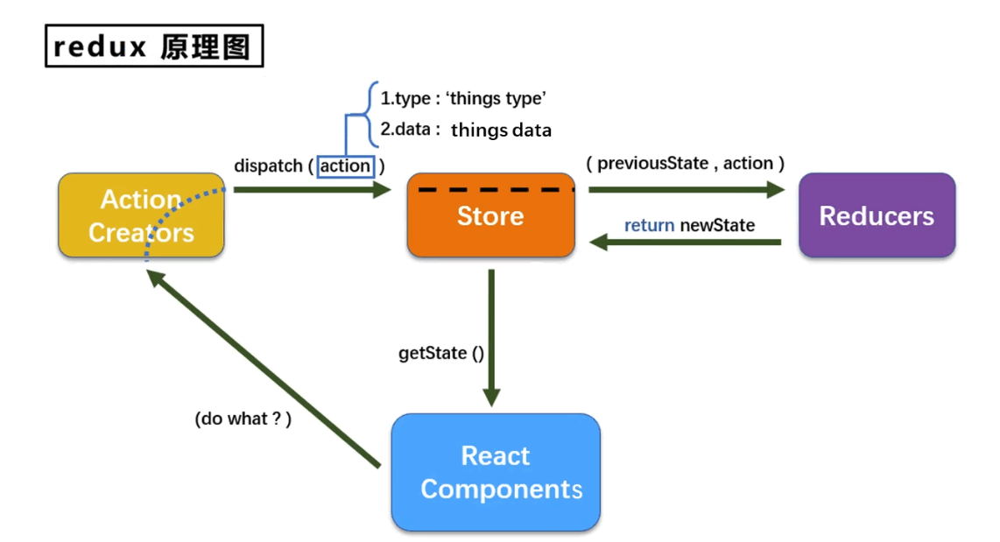

# React Basics

## 组件类别
### 类组件
:::info 简介
```js
import React from "react";

class Hoc extends React.Component {
  name = "Josh Perez";
  constructor(props) {
    super(props);
    this.state = {
      count: 0,
    };
    this.handleClick = this.handleClick.bind(this);
  }
  handleClick() {
    this.setState({ count: ++this.state.count });
  }
  render() {
    return (
      <div>
        <div>{this.name}</div>
        <div>{this.state.count}</div>
        <button onClick={this.handleClick}>Click me</button>
      </div>
    );
  }
}

export default Hoc;
```
:::

### 函数组件
:::info 简介
```js
import React, { useState, useEffect } from "react";

const Example = () => {
  // 声明一个新的叫做 “count” 的 state 变量
  const [count, setCount] = useState(0);
  useEffect(() => {
    return () => {
      console.log("Bye");
    };
  }, []);
  const handleClick = () => {
    setCount(count + 1);
  };
  return (
    <div>
      <p>You clicked {count} times</p>
      <button onClick={() => setCount(count + 1)}>Click me</button>
      <br />
      <button onClick={handleClick}>Click me</button>
    </div>
  );
};
export default Example;
```
:::

## 类组件和函数组件的区别

### 编写方式区别
1. 类组件使用 **class** 编写组件
2. 函数组件使用 **function** 编写组件

### 状态管理区别
1. 类组件使用 **this.state** 定义状态，**this.setState** 操作状态
2. 函数组件使用 **useState** 定义状态，返回数组[value, setValue]，**setValue** 操作状态

### 生命周期区别
1. 类组件存在 **componentDidMount** 等生命周期
2. 函数组件没有生命周期，使用 **useEffect** 替代 componentDidMount 和 componentDidUpdate
   1. **useEffect** 回调函数中 return 一个函数，则 return 的函数会在组件卸载的时候执行，正如componentWillUnmount

### 成员属性区别
1. 类组件通过 **this**调用内部成员
   1. 构造器 constructor 中 this 指向该实例对象（构造器只调⽤⼀次，只在 new 的时候调⽤）
   2. 事件调用中 this 指向丢失的原因
      1. 事件 onClick 触发执⾏时的函数在 dom 上直接调⽤，⽽不是在类实例对象中调⽤
      2. 由于普通函数的 this 指向为调⽤时所处的对象决定的，因⽽指向 window，⼜因为开启了 use strict， window 变为了 undefined
2. 函数组件直接使用内部成员，没有 **this**

## State
```js
// 定义 state
this.state = {
   count: 0,
   arr: [{ a: 1 }]
}
// 更新 state 方式一
this.setState({ count: ++this.state.count }, () => {
   this.setState({ count: ++this.state.count });
});
// 更新 state 方式二
this.setState(
   (state) => ({ count: ++state.count }),
   () => {
      this.setState({ count: ++this.state.count });
   }
);

// 第二个参数回调函数在 render 调用后才被调用
```

## Props
```js
// 1、读取传入的属性值
this.props.name
​
// 2、对props中的属性值进行类型限制和必要性限制
import PropTypes from 'prop-types'
Person.propTypes = {
  name: PropTypes.string.isRequired,
  age: PropTypes.number.
}
​
// 3、将对象的所有属性通过props传递
<Person {...person}/>
​
// 4、默认属性值
Person.defaultProps = {
  name: 'single',
  age: 18
}

// props是不可变的，⼦组件不可修改 props，由⽗组件传⼊⼦组件
```
## refs
```js
// 1、字符串形式的ref
<input ref="inputTarget" />
// 通过this.refs.inputTarget 获取DOM

// 2、回调形式的ref
<input ref={(target) => {this.inputTarget = target}} />
// 通过this.inputTarget 获取DOM
​
// 3、createRef创建ref容器
myRef = React.createRef()
<input ref={this.myRef} />
// 通过this.myRef.current 获取DOM

// refs访问绑定的 DOM 节点
```
## ⽣命周期

参考链接：https://projects.wojtekmaj.pl/react-lifecycle-methods-diagram/

### 挂载阶段
:::info 简介
1. **constructor(props)**: 构造函数最先调⽤
   1. 初始化内部 state
   2. 为事件处理函数绑定实例
2. **static getDerivedStateFromProps(props, state)**: 罕⻅⽤例，即 state 的值任何时候都取决于 props
   1. 静态方法，无 this
   2. ⼦组件的 state 取决于⽗组件的 props
   3. return props or null，会返回一个对象用来更新当前的 state 对象
3. **UNSAFE_componentWillMount()**: 在组件挂载前调用（DOM插入前）
4. **render()**: 是 class 组件中唯一必须实现的方法，返回需要渲染的DOM
   1. 原生的DOM，如div
   2. React组件
   3. Fragment（片段）
   4. Portals（插槽）
   5. 字符串和数字，被渲染成text节点
   6. Boolean和null，不会渲染任何东西
5. **componentDidMount()**: 在组件挂载后调用（DOM插入后）
   1. 适合添加订阅的地方
   2. 适合网络请求获取数据
   3. 获取DOM节点
:::

### 更新阶段
:::info 简介
1. **UNSAFE_componentWillReceiveProps(nextProps)**: 在组件接收 props 前调⽤
   1. 在更新⼦组件，需要重新渲染组件时⽤到的⽐较多，更新state
2. **static getDerivedStateFromProps(props, state)**: 罕⻅⽤例，即 state 的值任何时候都取决于 props
3. **shouldComponentUpdate(nextProps, nextState)**: 是否需要组件重新渲染
   1. 新的props，新的state
   2. return Boolean（true表示组件重新渲染， false表示组件不冲洗渲染）
4. **UNSAFE_componentWillUpdate(nextProps, nextState)**: 组件更新前
   1. 在组件收到新的 props 或 state 时触发
   2. 不能此方法中调用 this.setState()
5. **render()**: 是 class 组件中唯一必须实现的方法，返回需要渲染的DOM
6. **getSnapshotBeforeUpdate(prevProps, prevState)**: 获取快照在更新前， return的值在下个钩⼦中接收
   1. 在 DOM 更新前调⽤，可获取更新前的 DOM 信息
   2. return null or snapshotValue
7. **componentDidUpdate(prevProps, prevState, snapshotValue)**: 组件更新后
   1. 可以操作 DOM，发送请求等
:::

### 卸载阶段
:::info 简介
1. **componentWillUnmount()**: 组件卸载前触发
   1. 取消订阅等额外操作
:::

## 组件传值
### props
```js
// 1. 父 -> 子 传值
<Hoc job="工作"></Hoc>
// 子组件 this.props.job 使用


// 2. 子 -> 父 传值
callback = (value) => {
   // 此处的value便是子组件带回
   this.setState({
      info: value,
   })
}
<Son callback={this.callback} />

// 子组件 this.props.callback(e.target.value)
```

### context
```js
// context.js
import {createContext} from "react";

/**
 * Provider,Consumer来源于同一个createContext()
 * 通过Provider传入的value属性，将数据保存起来传递给其他组件
 * 实现跨组件传值
 *  */
const MyContext = createContext('context初始值');
const {Provider, Consumer} = MyContext;
export {MyContext, Provider, Consumer};

// person
<Provider value={111}>
   <Child/>
</Provider>

// child
<Consumer>
   {(value) => {
      return `这是context传的值${value}`;
   }}
</Consumer>
```

### events
```js
// events.js
import { EventEmitter } from "events";
export default new EventEmitter();

// person
// 组件初始化时添加事件监听
emitter.addListener("info", (info) => {
   console.log("监听", info);
});

// 组件销毁前移除事件监听
emitter.removeListener("info", (info) => {
   console.log("移除", info);
});

// child
// 发射事件
emitter.emit("info", "我是来自father的 info");
```
## 页面路由
### react-router-dom
1. 路由组件(router components) 比如 <BrowserRouter /> 和 <HashRouter />
   1. BrowserRouter 使用 HTML5 提供的 history API 实现
   2. HashRouter 使用 # 方式跟在 URL 后面
```js
import { BrowserRouter } from 'react-router-dom';

<BrowserRouter>
   <App />
</BrowserRouter>

<BrowserRouter>
   <App />
</BrowserRouter>
```
2. 路由匹配组件(route matchers components) 比如 <Route /> 和 <Switch />
   1. 通常由 Switch 包裹 Route 匹配 URL 路径是否一致
```js
import { Route, Switch, Redirect } from "react-router-dom";

<Switch>
   {/* 精确匹配 */}
   <Route path="/home">
      <Home />
   </Route>
   {/* 模糊匹配 */}
   {/* params接收参数 */}
   {/* <Route path="/page/:id" component={Page}></Route> */}
   {/* search接收参数、state接收参数 */}
   <Route path="/page" component={Page} />
   <Redirect to="/home" />
</Switch>
```
3. 导航组件(navigation components) 比如 <Link />, <NavLink />, 和 <Redirect />
```js
import { Link, NavLink } from "react-router-dom";

<Link to='/'>Home</Link>

// 匹配成功会添加class or style
<NavLink to='/about' activeClassName='active'>
  About
</NavLink>

// 重定向 URL
<Redirect to="/" />

```

## Redux

```js
// index.js
import { Provider } from "react-redux";
import store from "./redux/store";
import Main from "./main";

{/* 使用provider包裹app，让Main组件及所有后代组件都能接收到store */}
<Provider store={store}>
   <Main />
</Provider>
```
```js
// main.js
import { Component, Fragment } from "react";
import Todo from "./redux/Todo";

{/* 使用Todo */}
export default class Main extends Component {
  render() {
    return <Todo />;
  }
}
```
```js
// Todo.js
import React, { Component } from "react";
import store from "./store";
import actions from "./actions";
import { connect } from "react-redux";
import { Button } from "antd";

class Todo extends Component {
  constructor(props) {
    super(props);
    console.log(props);
  }
  componentDidMount() {
    this.unsubscribe = store.subscribe((e) => {
      console.log(this);
    });
  }
  componentWillUnmount() {
    this.unsubscribe(); //取消订阅
  }
  render() {
    //console.log('counter render')
    return (
      <div>
        <p>{this.props.number}</p>
        <Button onClick={this.props.increase}> + </Button>
        <br></br>
        <Button onClick={this.props.decrease}> - </Button>
        <br></br>
        <br></br>
        <Button onClick={this.props.typeOpen}> open </Button>
        <br></br>
        <Button onClick={this.props.typeClose}> close </Button>
      </div>
    );
  }
}
/* 连接 Redux 和 React，它包在我们的容器组件的外一层，
   它接收上面 Provider 提供的 store 里面的 state 和 dispatch，
   传给一个构造函数，返回一个对象，以属性形式传回容器组件。
*/

// connect([mapStateToProps], [mapDispatchToProps], [mergeProps], [options])
/*
1. mapStateToProps: 将store中的数据作为props绑定到组件中，这个对象会与组件的props合并
2. mapDispatchToProps: 将actions作为props绑定到组件中
3. mergeProps: 接收reducer和state，返回的对象则是传入组件的props
*/
export default connect(
  (state) => state,
  actions,
  (reducer, state) => {
    return { ...reducer, ...state };
  }
)(Todo);
```
```js
// store.js
import { createStore } from "redux";
import { composeWithDevTools } from "redux-devtools-extension";
import rootReducer from "./reducers";
// 创建 store，传入reducer
const store = createStore(rootReducer, composeWithDevTools());

export default store;
```
```js
// reducers.js
import { combineReducers } from "redux";
import constant from "./constant";

const reducer = (state = { count: 0 }, action) => {
  switch (action.type) {
    case constant.INCREASE:
      return { count: state.count + 1 };
    case constant.DECREASE:
      return { count: state.count - 1 };
    default:
      return state;
  }
};

const changeTypeReducer = (state = { type: "open" }, action) => {
  switch (action.type) {
    case constant.TYPE_OPEN:
      return { type: "open" };
    case constant.TYPE_CLOSE:
      return { type: "close" };
    default:
      return state;
  }
};

// 汇总所有reducer变为一个总的reducer
export default combineReducers({
  reducer,
  changeTypeReducer,
});
```
```js
// actions.js
import constant from "./constant";

export default {
  increase: () => ({ type: constant.INCREASE }),
  decrease: () => ({ type: constant.DECREASE }),
  typeOpen: () => ({ type: constant.TYPE_OPEN }),
  typeClose: () => ({ type: constant.TYPE_CLOSE }),
};
```
```js
// constant.js
export default {
  INCREASE: "INCREASE",
  DECREASE: "DECREASE",
  TYPE_OPEN: "TYPE_OPEN",
  TYPE_CLOSE: "TYPE_CLOSE",
};
```
