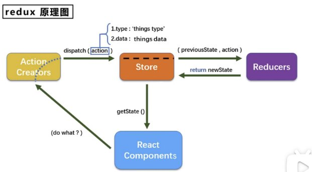

# React Basics

## 组件
1. 函数组件（简单组件）
   1. ⽆状态组件，不能驱动视图更新
   1. 没有 this指向
2. 类组件（复杂组件）
   1. 有状态组件，驱动视图更新
   2. 有 this指向
   3. 构造器 constructor中的 this指向该实例对象（构造器只调⽤⼀次，只在 new的时候调⽤）
   4. 类⽅法中的 this指向丢失的原因？？？
      1. 函数指向给 onclick， onclick点击时执⾏的函数在 dom上 **直接调⽤** ，⽽ **不是在类实例对象中调⽤**
      2. 由于普通函数的 this指向为调⽤时所处的对象决定的，因⽽指向 window，⼜因为开启了 use strict， window变为了 undefined
3. 三⼤属性
   1. state：
      1. 是⼀个对象，称为状态
      2. 包含多个 key-value
      3. 更新 state中的属性值，便可以重新渲染对应 UI视图⻚⾯
         1. state不可以直接更改属性
         2. 使⽤ this.setState({})只修改对应的属性以更改数据，驱动更改视图层
   2. props
      1. props是不可变的，⼦组件不可修改 props，由⽗组件传⼊⼦组件
      2. 对⼦组件传⼊ prop
      3. import PropTypes from ‘prop-typesʼ，引⼊对属性 prop的限制
      4. MyComponent.propTypes = { name: PropTypes.string.isRequired }；属性限制
      5. MyComponent.defaultProps = { name: 'json' }：属性默认值
   3. refs
      1. 属性定义到 render中任何标签或组件上，以访问绑定的 dom节点
      2. ⻚⾯内所有输⼊类 dom，现⽤现取，属于⾮受控组件
      3. ⻚⾯内所有输⼊类 dom，value值存储于 state⾥⾯，需要⽤的时候才拿出来，数据由 state状态管理，属 于受控组件
         1. `<input ref="input1" />`
         2. `<input ref={e => (this.input2 = e)} />`（更新数据时会触发两次事件，⼀次为 null⼀次为 dom节点；因 为每次渲染时会创建⼀个新的函数实例，所以 react清空旧的 ref并设置新的）
         3. 通过将回调函数定义成 class的绑定函数可以避免
         4. `<input ref={this.input1} />`（通过 input1函数的形参接收 dom节点）
         5. myRef = React.createRef()； <input ref={this.myRef} />； this.myRef.current则指向 dom
4. ⽣命周期
   1. 挂载阶段
      1. constructor(props)（构造函数最先调⽤）
      2. static getDerivedStateFromProps(props, state)（罕⻅⽤例，即 state的值取决于 props）
         1. ⼦组件的 state取决于⽗组件的 props
         2. return props or null
      3. componentWillmount（在组件挂载前）
      4. render（渲染）
      5. componentDidmount（在组件挂载后）
   2. 更新阶段
      1. props传⼊的更新阶段
         1. componentWillReceiveRrops(nextProps)（在组件接收参数前调⽤）
            1. 在更新⼦组件，需要重新渲染组件时⽤到的⽐较多
         2. shouldComponentUpdate（需要组件更新）
            1. return Boolean（ true表示组件更新， false表示组件不更新）
         3. componentWillUpdate（组件更新前）
         4. render（渲染）
         5. getSnapshotBeforeUpdate（获取快照在更新前， return的值在下个钩⼦中接收）
            1. 在 dom更新前调⽤，获取更新前的 dom信息
            2. return null or snapshotValue
         6. componentDidUpdate(preProps, preState, snapshotValue)（组件更新后）
      2. state渲染更新
         1. shouldComponentUpdate
         2. componentWillUpdate
         3. render
         4. componentDidUpdate
   3. 卸载阶段
      1. componentWillUnmount（组件卸载前）
5. ⽗⼦组件传值
   1. ⽗传⼦， **通过** prop**属性传值**
   2. ⼦传⽗，通过 prop属性 **将⽗组件⽅法传⼊⼦组件** ，⼦组件 **调⽤传⼊的属性⽅法** ， **触发⽗组件的⽅法**
6. react-router-dom
   1. 路由组件和⼀般组件的区别
   2. 精确匹配和模糊匹配
   3. params和 search(query)、 state
   4. 编程式路由导航 this.props.history.push('')
   5. withRouter可以使⾮路由组件拥有路由组件特有的 API，进⾏编程式导航

7. redux

   1. 异步和同步 action
   2. react-redux集中式管理
1. react-router
2. hooks
3. Fragment、 Context、 PureComponent、 getderivedStateFromError、 renderProps(插槽 )
4. 组件间传值⽅式
   1. ⽗⼦： props
   2. 兄弟： pubsub、 redux
   3. 祖孙组件： pubsub、 redux、 context
