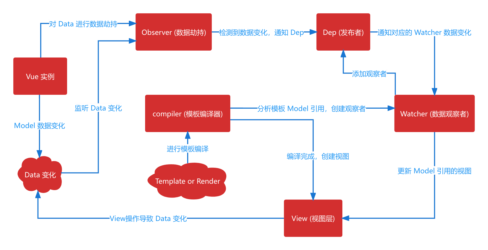

# Vue2 Reactive


:::info 简介
**Vue2 响应式基本流程：**  
1. Vue实例创建 -> Observer 对实例中 Data 遍历使用 Object.defineProperty 进行数据劫持，并使用 getter 和 setter 获取监听
2. Vue Template or Render 进行编译 -> 编译中遇到 Model变量 的引用 -> 创建 Watcher观察者 -> 并通过 Object.defineProperty 中的 getter 向 Dep发布者 添加观察者 -> 最后编译完成，创建 View层  
3. View层 or Model层 的数据变化 -> 会被 Object.defineProperty 监听到变化 -> 此时 Dep 进行遍历 Watcher 进行通知 -> Watcher 内部通过 newValue和oldValue 的比较来更新 View层
:::
## Dep
:::info 发布者
存储 Watcher观察者，并通知 Watcher观察者 数据已变化  
```js
class Dep {
    constructor() {
        // 存储所有Watcher
        this.subs = [];
    }
    // 添加Watcher
    addSub(sub) {
        this.subs.push(sub);
    }
    // 对每个Watcher发布通知
    notify() {
        this.subs.forEach((sub) => {
            sub.update();
        });
    }
}
```
:::
## Observer
:::info 数据劫持
对 data对象 中的数据进行数据劫持  
并在 Compiler编译时，添加 Watcher观察者，以便后续数据变化进行通知更新  
```js
class Observer {
  constructor(data) {
    // 触发数据劫持
    this.transitionData(data);
  }
  // 遍历data进行数据劫持
  transitionData(data) {
    // 检测属性值是否是对象，如果是则继续将对象转换为响应式的
    if (typeof data === "object" && !Array.isArray(data)) {
      Object.keys(data).forEach((key) => {
        this.defineReactive(data, key, data[key]);
      });
    }
  }
  // 将data中的属性注册为响应式
  defineReactive(data, key, value) {
    // 递归注册属性
    this.transitionData(value);
    // 创建Dep对象 给每个data添加一个观察者
    let dep = new Dep();
    const that = this;
    Object.defineProperty(data, key, {
      enumerable: true,
      configurable: true,
      get() {
        // 当Watcher创建时，会对Dep.target赋值为Watcher实例，并访问Data对应属性
        // 这将触发该get，并往Dep添加Watcher观察者，最后清空Dep.target，返回value
        Dep.target && dep.addSub(Dep.target);
        return value;
      },
      set(newValue) {
        // 若新值等于旧值则返回
        if (newValue == value) {
          return;
        }
        // 向该作用域中value进行更新赋值
        value = newValue;
        // 赋值以后检查属性是否是对象，如果是则继续将对象转换为响应式的
        that.transitionData(newValue);
        // 数据变化后通过Dep发送通知
        // 这将循环Watcher对比vm[key] !== oldValue，如果成立则触发update方法
        dep.notify();
      },
    });
  }
}
```
:::
## Watcher
:::info 观察者
存储 vue实例、响应属性、回调函数，以及缓存响应属性值，并将自身实例对象存储到 Dep发布者中  
update函数 比较新旧值，并调用 回调函数 传入新值，更新视图  
```js
class Watcher {
  constructor(vm, key, cb) {
    // 获取vm
    this.vm = vm;
    // 获取data中的属性
    this.key = key;
    // 回调函数（更新视图的具体方法）
    this.cb = cb;
    // 将watcher对象挂载到Dep.target
    Dep.target = this;
    // 访问缓存旧值，同时触发数据劫持中对应属性的get，在Dep中存储Watcher实例，用来后续通知数据更新
    this.oldValue = vm[key];
    // get值之后，清除Dep中的实例
    Dep.target = null;
  }
  // 通过Dep通知调用，更新视图
  update() {
    // 调用update的时候，获取新值
    let newValue = this.vm[this.key];
    // 新值和旧值相同则不更新
    if (newValue === this.oldValue) return;
    this.oldValue = newValue;
    // 调用具体的更新方法
    this.cb(newValue);
  }
}
```
:::
## Compiler
:::info 编译器
编译模板，解析指令/插值表达式  
当数据变化后，通过 Watcher观察者 重新渲染视图  
```js
class Compiler {
  constructor(vm) {
    // 获取vm
    this.vm = vm;
    // 获取el
    this.el = vm.$el;
    // 编译模板 渲染视图
    this.compile(this.el);
  }
  // 编译模板渲染视图
  compile(el) {
    // 无el则结束
    if (!el) return;
    // 获取子节点
    const nodes = el.childNodes;
    nodes.forEach((node) => {
      // 判断是否为文本节点
      // 这里只对文本进行判断，需判断其它节点可在此进行扩展
      if (this.isTextNode(node)) {
        this.compileText(node);
      }
    });
  }
  // 编译文本节点
  compileText(node) {
    // 表示任意单个字符，不包含换行符、+ 表示匹配前面多个相同的字符、？表示非贪婪模式，尽可能早的结束查找
    const reg = /\{\{(.+?)\}\}/;
    // 获取节点的文本内容
    var param = node.textContent;
    // 判断是否有 {{}}
    if (reg.test(param)) {
      // 匹配内容，去除前后空格
      const key = reg.exec(param)[1].trim();
      // value赋值给node文本内容
      node.textContent = param.replace(reg, this.vm[key]);
      // 编译模板的时，会创建一个watcher实例，并在内部挂载到Dep上
      // Watcher内部会进行访问存储，并添加到Dep中用来后续通知数据更新
      new Watcher(this.vm, key, (newValue) => {
        // 通过回调函数，更新视图
        node.textContent = newValue;
      });
    }
  }
  // 判断是否是文本节点
  isTextNode(node) {
    return node && node.nodeType === 3;
  }
  // 判断是否是元素节点
  isElementNode(node) {
    return node && node.nodeType === 1;
  }
}
```
:::
## Vue
:::info Vue实例对象
入口类，调用 Observer、Compiler 进行数据劫持、模板编译  
挂载 data数据
```js
class Vue {
  constructor(options) {
    // 将Vue实例挂载到el元素上
    this.$el = document.querySelector(options.el);
    // 获取绑定data数据
    this.$data = options.data;
    // 对data所有数据进行递归劫持
    new Observer(this.$data);
    // 在Vue实例对象上挂载data的所有属性
    this._proxyData(this.$data);
    // 传入Vue实例，编译解析模板
    new Compiler(this);
    console.log(this);
  }
  // 在Vue实例对象上挂载data的所有属性
  _proxyData(data) {
    // 遍历data对象的所有属性，进行数据劫持，挂载到Vue实例根上
    Object.keys(data).forEach((key) => {
      Object.defineProperty(this, key, {
        enumerable: true,
        configurable: true,
        get() {
          return data[key];
        },
        set(newValue) {
          if (newValue === data[key]) {
            return;
          }
          data[key] = newValue;
        },
      });
    });
  }
}
```
:::
## 最后集成
```html
<!DOCTYPE html>
<html lang="en">
  <head>
    <meta charset="UTF-8" />
    <meta http-equiv="X-UA-Compatible" content="IE=edge" />
    <meta name="viewport" content="width=device-width, initial-scale=1.0" />
    <title>Vue2_Reactive</title>
    <style>
      * {
        text-align: center;
      }
    </style>
    <script src="./js/Dep.js"></script>
    <script src="./js/Observer.js"></script>
    <script src="./js/Watcher.js"></script>
    <script src="./js/Compiler.js"></script>
    <script src="./js/Vue.js"></script>
  </head>
  <body>
    <div id="app">
      {{ count }}
      <hr />
      <button type="button" onclick="notifyMe()">add count !!!</button>
    </div>
    <script>
      // 初始化数据
      const data = {
        count: 0,
        arr: [1, 2, 3],
        obj: {
          childName: "test",
        },
      };
      let vm = new Vue({
        el: "#app",
        data: data,
      });
      const notifyMe = () => {
        data.count++;
      };
    </script>
  </body>
</html>
```